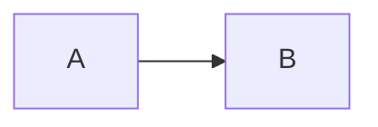
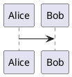

# SLIDEV - VOLLSTÄNDIGE FEATURE-ÜBERSICHT

## GESAMTSTATISTIK
- **Gesamt: 280+ dokumentierte Features**
- Quellen: Offizielle Dokumentation (sli.dev), GitHub-Repository, Community-Ressourcen
- Version: v52.x+ (November 2025)

---

## 1. KERN-FEATURES (40 Features)

### Standard Markdown Support
**Beschreibung:** Volle Unterstützung für Standard-Markdown-Syntax inklusive Überschriften, Formatierung, Listen, Links und Bilder  
**Verwendung:** Standard-Markdown schreiben  
**Beispiel:**
```md
# Überschrift 1
**Fett** und *kursiv*
- Liste
[Link](https://example.com)
```
**Kategorie:** Markdown-Syntax  
**Komplexität:** Einfach

### HTML in Markdown
**Beschreibung:** HTML-Elemente direkt in Markdown einbetten  
**Verwendung:** HTML-Tags direkt schreiben  
**Beispiel:**
```html
<div class="p-3">
  <p>HTML-Inhalt</p>
</div>
```
**Kategorie:** Markdown-Syntax  
**Komplexität:** Einfach

### Vue Components Integration
**Beschreibung:** Vue 3 Komponenten direkt in Slides einbetten  
**Verwendung:** Komponenten mit spitzen Klammern  
**Beispiel:**
```html
<Tweet id="20" />
<Counter :count="10" />
```
**Kategorie:** Markdown-Syntax  
**Komplexität:** Mittel

### UnoCSS Utility Classes
**Beschreibung:** Atomare CSS-Klassen direkt anwenden  
**Verwendung:** Klassen zu Elementen hinzufügen  
**Beispiel:**
```html
<div class="text-3xl text-red-400 mx-2">
  Gestylter Inhalt
</div>
```
**Kategorie:** Styling  
**Komplexität:** Mittel

### Scoped CSS
**Beschreibung:** CSS nur für aktuelle Slide  
**Verwendung:** <style> Tag in Slide  
**Beispiel:**
```html
<style>
h1 { color: red; }
</style>
```
**Kategorie:** Styling  
**Komplexität:** Einfach

### MDC Syntax
**Beschreibung:** Erweiterte Markdown-Syntax für Styling  
**Verwendung:** mdc: true aktivieren  
**Beispiel:**
```md
# Titel {.text-red}
[Text]{.highlight}
```
**Kategorie:** Markdown-Syntax  
**Komplexität:** Mittel

### Icons
**Beschreibung:** Zugriff auf Iconify-Kollektion  
**Verwendung:** Icon-Komponenten-Syntax  
**Beispiel:**
```html
<mdi-account-circle />
<carbon-badge />
```
**Kategorie:** Markdown-Syntax  
**Komplexität:** Einfach

### LaTeX Math
**Beschreibung:** Mathematische Gleichungen mit KaTeX  
**Verwendung:** $ für inline, $$ für Block  
**Beispiel:**
```md
$a^2 + b^2 = c^2$

$$\nabla \times \vec{\mathbf{B}}$$
```
**Kategorie:** Markdown-Syntax  
**Komplexität:** Mittel

### Presenter Notes
**Beschreibung:** Private Notizen für Presenter  
**Verwendung:** HTML-Kommentare am Slide-Ende  
**Beispiel:**
```md
<!-- Notiz für Präsentator -->
```
**Kategorie:** Presenter-Mode  
**Komplexität:** Einfach

### Headmatter Configuration
**Beschreibung:** Globale Präsentationskonfiguration  
**Verwendung:** YAML-Block am Anfang  
**Beispiel:**
```yaml
---
theme: default
title: Meine Präsentation
author: Name
---
```
**Kategorie:** Konfiguration  
**Komplexität:** Mittel

### Slide Frontmatter
**Beschreibung:** Pro-Slide-Konfiguration  
**Verwendung:** YAML vor Slide-Inhalt  
**Beispiel:**
```yaml
---
layout: center
background: /image.png
---
```
**Kategorie:** Konfiguration  
**Komplexität:** Mittel

### Layout Property
**Beschreibung:** Layout für Slide wählen  
**Verwendung:** layout im Frontmatter  
**Beispiel:**
```yaml
---
layout: image-right
image: /photo.jpg
---
```
**Kategorie:** Layouts  
**Komplexität:** Einfach

### Background Property
**Beschreibung:** Hintergrundbild/-farbe setzen  
**Verwendung:** background-Property  
**Beispiel:**
```yaml
---
background: /bg.png
---
```
**Kategorie:** Styling  
**Komplexität:** Einfach

### Class Property
**Beschreibung:** CSS-Klassen auf Slide anwenden  
**Verwendung:** class-Property  
**Beispiel:**
```yaml
---
class: text-center text-white
---
```
**Kategorie:** Styling  
**Komplexität:** Einfach

### Transition Property
**Beschreibung:** Slide-Übergänge definieren  
**Verwendung:** transition-Property  
**Beispiel:**
```yaml
---
transition: slide-left
---
```
**Kategorie:** Animationen  
**Komplexität:** Mittel

### Clicks Property
**Beschreibung:** Klick-Anzahl überschreiben  
**Verwendung:** clicks-Property mit Zahl  
**Beispiel:**
```yaml
---
clicks: 5
---
```
**Kategorie:** Animationen  
**Komplexität:** Einfach

### HideInToc Property
**Beschreibung:** Von TOC ausschließen  
**Verwendung:** hideInToc: true  
**Beispiel:**
```yaml
---
hideInToc: true
---
```
**Kategorie:** Navigation  
**Komplexität:** Einfach

### RouteAlias Property
**Beschreibung:** Custom URL-Pfad erstellen  
**Verwendung:** routeAlias setzen  
**Beispiel:**
```yaml
---
routeAlias: demo
---
```
**Kategorie:** Navigation  
**Komplexität:** Mittel

### Zoom Property
**Beschreibung:** Slide-Zoom anpassen  
**Verwendung:** zoom mit Dezimalzahl  
**Beispiel:**
```yaml
---
zoom: 0.75
---
```
**Kategorie:** Layouts  
**Komplexität:** Einfach

### Src Property
**Beschreibung:** Externe Slides importieren  
**Verwendung:** src mit Dateipfad  
**Beispiel:**
```yaml
---
src: ./chapter1.md
---
```
**Kategorie:** Konfiguration  
**Komplexität:** Mittel

### Preload Property
**Beschreibung:** Vorladen steuern  
**Verwendung:** preload: true/false  
**Beispiel:**
```yaml
---
preload: false
---
```
**Kategorie:** Performance  
**Komplexität:** Einfach

### Title Property
**Beschreibung:** Slide-Titel überschreiben  
**Verwendung:** title-Property  
**Beispiel:**
```yaml
---
title: Custom Titel
---
```
**Kategorie:** Konfiguration  
**Komplexität:** Einfach

### Level Property
**Beschreibung:** Überschrift-Level für TOC  
**Verwendung:** level mit 1-6  
**Beispiel:**
```yaml
---
level: 2
---
```
**Kategorie:** Konfiguration  
**Komplexität:** Einfach

### Disabled Property
**Beschreibung:** Slide komplett ausblenden  
**Verwendung:** disabled: true  
**Beispiel:**
```yaml
---
disabled: true
---
```
**Kategorie:** Konfiguration  
**Komplexität:** Einfach

### Triple Dash Separator
**Beschreibung:** Slides trennen  
**Verwendung:** --- auf eigener Zeile  
**Beispiel:**
```md
# Slide 1
---
# Slide 2
```
**Kategorie:** Slide-Trennung  
**Komplexität:** Einfach

### Default Frontmatter
**Beschreibung:** Globale Slide-Defaults  
**Verwendung:** defaults in Headmatter  
**Beispiel:**
```yaml
---
defaults:
  layout: center
  transition: fade
---
```
**Kategorie:** Konfiguration  
**Komplexität:** Mittel

---

## 2. ANIMATIONEN (15 Features)

### v-click
**Beschreibung:** Click-basierte Show/Hide-Animationen  
**Verwendung:** Als Komponente oder Direktive  
**Beispiel:**
```html
<v-click>Text</v-click>
<div v-click>Text</div>
```
**Kategorie:** Klick-Animationen  
**Komplexität:** Einfach

### v-after
**Beschreibung:** Gleichzeitig mit vorherigem v-click  
**Verwendung:** Nach v-click Element  
**Beispiel:**
```html
<div v-click>Eins</div>
<div v-after>Zwei</div>
```
**Kategorie:** Klick-Animationen  
**Komplexität:** Einfach

### v-click.hide
**Beschreibung:** Elemente ausblenden beim Klick  
**Verwendung:** .hide Modifier  
**Beispiel:**
```html
<div v-click.hide>Verschwindet</div>
```
**Kategorie:** Klick-Animationen  
**Komplexität:** Einfach

### v-clicks
**Beschreibung:** Batch-Animationen für Kinder  
**Verwendung:** Wrapper-Komponente  
**Beispiel:**
```html
<v-clicks>
- Item 1
- Item 2
</v-clicks>
```
**Kategorie:** Klick-Animationen  
**Komplexität:** Einfach

### v-click Absolute Positioning
**Beschreibung:** Exakte Klick-Nummer  
**Verwendung:** Nummer übergeben  
**Beispiel:**
```html
<div v-click="3">Bei Klick 3</div>
```
**Kategorie:** Klick-Animationen  
**Komplexität:** Mittel

### v-click Relative Positioning
**Beschreibung:** Relative Klick-Positionierung  
**Verwendung:** +/- Notation  
**Beispiel:**
```html
<div v-click="'+2'">2 Klicks später</div>
```
**Kategorie:** Klick-Animationen  
**Komplexität:** Mittel

### v-click Enter/Leave
**Beschreibung:** Erscheinen und Verschwinden  
**Verwendung:** Array [enter, leave]  
**Beispiel:**
```html
<div v-click="[2, 4]">Bei 2-3</div>
```
**Kategorie:** Klick-Animationen  
**Komplexität:** Mittel

### v-switch
**Beschreibung:** Inhalts-Wechsel  
**Verwendung:** Template-Slots  
**Beispiel:**
```html
<v-switch>
  <template #1>Zustand 1</template>
  <template #2>Zustand 2</template>
</v-switch>
```
**Kategorie:** Klick-Animationen  
**Komplexität:** Mittel

### Custom Click Transitions
**Beschreibung:** CSS-Übergänge anpassen  
**Verwendung:** CSS-Klassen überschreiben  
**Beispiel:**
```css
.slidev-vclick-target {
  transition: all 500ms;
}
.slidev-vclick-hidden {
  transform: scale(0);
}
```
**Kategorie:** Übergänge  
**Komplexität:** Mittel

### v-motion
**Beschreibung:** Komplexe Motion-Animationen  
**Verwendung:** VueUse Motion States  
**Beispiel:**
```html
<div
  v-motion
  :initial="{ x: -80 }"
  :enter="{ x: 0 }"
>Content</div>
```
**Kategorie:** Motion  
**Komplexität:** Komplex

### v-motion with Clicks
**Beschreibung:** Click-getriggerte Motions  
**Verwendung:** :click-N States  
**Beispiel:**
```html
<div
  v-motion
  :click-1="{ y: 30 }"
  :click-2="{ y: 60 }"
>Content</div>
```
**Kategorie:** Motion  
**Komplexität:** Komplex

### Slide Transitions
**Beschreibung:** Übergänge zwischen Slides  
**Verwendung:** transition-Property  
**Beispiel:**
```yaml
---
transition: slide-left
---
```
**Kategorie:** Slide-Übergänge  
**Komplexität:** Einfach

### Bidirectional Transitions
**Beschreibung:** Vor-/Rückwärts-Übergänge  
**Verwendung:** Pipe-Separator  
**Beispiel:**
```yaml
---
transition: slide-left | slide-right
---
```
**Kategorie:** Slide-Übergänge  
**Komplexität:** Mittel

### View Transitions API
**Beschreibung:** Browser View Transitions  
**Verwendung:** view-transition aktivieren  
**Beispiel:**
```yaml
---
transition: view-transition
mdc: true
---
```
**Kategorie:** Slide-Übergänge  
**Komplexität:** Komplex

### v-mark
**Beschreibung:** Handgezeichnete Annotationen  
**Verwendung:** Rough Notation  
**Beispiel:**
```html
<span v-mark.underline>Text</span>
<span v-mark.circle>Text</span>
<span v-mark.highlight>Text</span>
```
**Kategorie:** Highlighting  
**Komplexität:** Einfach

---

## 3. LAYOUTS (19 Features)

### default
**Beschreibung:** Basis-Layout  
**Verwendung:** layout: default  
**Kategorie:** Allgemein  
**Komplexität:** Einfach

### cover
**Beschreibung:** Titelseite  
**Verwendung:** layout: cover  
**Kategorie:** Spezial  
**Komplexität:** Einfach

### center
**Beschreibung:** Zentrierter Inhalt  
**Verwendung:** layout: center  
**Kategorie:** Positionierung  
**Komplexität:** Einfach

### two-cols
**Beschreibung:** Zwei-Spalten  
**Verwendung:** layout: two-cols mit ::right::  
**Kategorie:** Multi-Spalten  
**Komplexität:** Mittel

### two-cols-header
**Beschreibung:** Header + zwei Spalten  
**Verwendung:** layout: two-cols-header  
**Kategorie:** Multi-Spalten  
**Komplexität:** Mittel

### image-left
**Beschreibung:** Bild links, Content rechts  
**Verwendung:** layout: image-left + image  
**Kategorie:** Bild-Layout  
**Komplexität:** Einfach

### image-right
**Beschreibung:** Bild rechts, Content links  
**Verwendung:** layout: image-right + image  
**Kategorie:** Bild-Layout  
**Komplexität:** Einfach

### image
**Beschreibung:** Vollbild-Bild  
**Verwendung:** layout: image + image  
**Kategorie:** Bild-Layout  
**Komplexität:** Einfach

### iframe-left
**Beschreibung:** Iframe links  
**Verwendung:** layout: iframe-left + url  
**Kategorie:** Embed  
**Komplexität:** Mittel

### iframe-right
**Beschreibung:** Iframe rechts  
**Verwendung:** layout: iframe-right + url  
**Kategorie:** Embed  
**Komplexität:** Mittel

### iframe
**Beschreibung:** Vollbild-Iframe  
**Verwendung:** layout: iframe + url  
**Kategorie:** Embed  
**Komplexität:** Mittel

### intro
**Beschreibung:** Intro-Slide  
**Verwendung:** layout: intro  
**Kategorie:** Spezial  
**Komplexität:** Einfach

### section
**Beschreibung:** Abschnitts-Trenner  
**Verwendung:** layout: section  
**Kategorie:** Organisation  
**Komplexität:** Einfach

### quote
**Beschreibung:** Zitat-Display  
**Verwendung:** layout: quote  
**Kategorie:** Inhalt  
**Komplexität:** Einfach

### fact
**Beschreibung:** Fakten prominent  
**Verwendung:** layout: fact  
**Kategorie:** Daten  
**Komplexität:** Einfach

### statement
**Beschreibung:** Statement-Display  
**Verwendung:** layout: statement  
**Kategorie:** Inhalt  
**Komplexität:** Einfach

### end
**Beschreibung:** Schluss-Slide  
**Verwendung:** layout: end  
**Kategorie:** Spezial  
**Komplexität:** Einfach

### full
**Beschreibung:** Vollbildschirm  
**Verwendung:** layout: full  
**Kategorie:** Vollbild  
**Komplexität:** Einfach

### none
**Beschreibung:** Leeres Layout  
**Verwendung:** layout: none  
**Kategorie:** Minimal  
**Komplexität:** Einfach

---

## 4. KOMPONENTEN (25+ Features)

### Arrow
**Beschreibung:** Pfeile zeichnen  
**Verwendung:** <Arrow x1 y1 x2 y2 />  
**Kategorie:** Annotation  
**Komplexität:** Einfach

### Toc
**Beschreibung:** Inhaltsverzeichnis  
**Verwendung:** <Toc />  
**Kategorie:** Navigation  
**Komplexität:** Einfach

### Link
**Beschreibung:** Interne Links  
**Verwendung:** <Link to="5">  
**Kategorie:** Navigation  
**Komplexität:** Mittel

### Tweet
**Beschreibung:** Twitter-Embed  
**Verwendung:** <Tweet id="" />  
**Kategorie:** Media  
**Komplexität:** Einfach

### Youtube
**Beschreibung:** YouTube-Embed  
**Verwendung:** <Youtube id="" />  
**Kategorie:** Media  
**Komplexität:** Einfach

### SlidevVideo
**Beschreibung:** Erweiterter Video-Player  
**Verwendung:** <SlidevVideo autoplay controls>  
**Kategorie:** Media  
**Komplexität:** Mittel

### Transform
**Beschreibung:** Skalierung/Transform  
**Verwendung:** <Transform :scale="0.5">  
**Kategorie:** Layout  
**Komplexität:** Mittel

### LightOrDark
**Beschreibung:** Theme-abhängiger Content  
**Verwendung:** <LightOrDark> mit Slots  
**Kategorie:** Konditional  
**Komplexität:** Einfach

### RenderWhen
**Beschreibung:** Kontext-basiertes Rendering  
**Verwendung:** <RenderWhen context="">  
**Kategorie:** Konditional  
**Komplexität:** Mittel

### VDrag
**Beschreibung:** Ziehbare Elemente  
**Verwendung:** <v-drag> oder v-drag=""  
**Kategorie:** Interaktiv  
**Komplexität:** Mittel

### VSwitch
**Beschreibung:** Content-Wechsel  
**Verwendung:** <v-switch> mit Templates  
**Kategorie:** Animation  
**Komplexität:** Mittel

### VClicks
**Beschreibung:** Batch-Klicks  
**Verwendung:** <v-clicks>  
**Kategorie:** Animation  
**Komplexität:** Einfach

### AutoFitText
**Beschreibung:** Auto-Textgröße  
**Verwendung:** <AutoFitText :max :min>  
**Kategorie:** Text  
**Komplexität:** Mittel

### SlideCurrentNo
**Beschreibung:** Aktuelle Slide-Nummer  
**Verwendung:** <SlideCurrentNo />  
**Kategorie:** Info  
**Komplexität:** Einfach

### SlidesTotal
**Beschreibung:** Gesamt-Slides  
**Verwendung:** <SlidesTotal />  
**Kategorie:** Info  
**Komplexität:** Einfach

---

## 5. CODE-FEATURES (11 Features)

### Syntax Highlighting (Shiki)
**Beschreibung:** VS Code-genaues Highlighting  
**Verwendung:** Code-Block mit Sprache  
**Beispiel:**
````md
```typescript
console.log('Hello')
```
````
**Kategorie:** Code  
**Komplexität:** Einfach

### Line Highlighting
**Beschreibung:** Zeilen hervorheben  
**Verwendung:** {2,3} nach Sprache  
**Beispiel:**
````md
```ts {2,3}
code
```
````
**Kategorie:** Code  
**Komplexität:** Einfach

### Dynamic Line Highlighting
**Beschreibung:** Click-basiertes Highlighting  
**Verwendung:** {2|3|all}  
**Beispiel:**
````md
```ts {2|3|all}
code
```
````
**Kategorie:** Code  
**Komplexität:** Mittel

### Line Numbers
**Beschreibung:** Zeilennummern  
**Verwendung:** {lines:true}  
**Beispiel:**
````md
```ts {lines:true}
code
```
````
**Kategorie:** Code  
**Komplexität:** Einfach

### Max Height
**Beschreibung:** Scrollbare Code-Blöcke  
**Verwendung:** {maxHeight:'100px'}  
**Beispiel:**
````md
```ts {maxHeight:'100px'}
code
```
````
**Kategorie:** Code  
**Komplexität:** Einfach

### Monaco Editor
**Beschreibung:** Vollwertiger Code-Editor  
**Verwendung:** {monaco}  
**Beispiel:**
````md
```ts {monaco}
code
```
````
**Kategorie:** Code  
**Komplexität:** Mittel

### Monaco Diff
**Beschreibung:** Side-by-side Diff  
**Verwendung:** {monaco-diff}  
**Beispiel:**
````md
```ts {monaco-diff}
old
~~~
new
```
````
**Kategorie:** Code  
**Komplexität:** Mittel

### Monaco Runner
**Beschreibung:** Code ausführen  
**Verwendung:** {monaco-run}  
**Beispiel:**
````md
```ts {monaco-run}
console.log('test')
```
````
**Kategorie:** Code  
**Komplexität:** Komplex

### Import Code Snippets
**Beschreibung:** Externen Code importieren  
**Verwendung:** <<< @/path  
**Beispiel:**
```md
<<< @/snippets/code.js
```
**Kategorie:** Code  
**Komplexität:** Mittel

### Shiki Magic Move
**Beschreibung:** Sanfte Code-Übergänge  
**Verwendung:** ````md magic-move  
**Kategorie:** Code  
**Komplexität:** Mittel

### TwoSlash
**Beschreibung:** TypeScript Type-Hints  
**Verwendung:** twoslash Identifier  
**Beispiel:**
````md
```ts twoslash
const x = 1
//    ^?
```
````
**Kategorie:** Code  
**Komplexität:** Mittel

---

## 6. INTERAKTIVITÄT (10 Features)

### Vue Components
**Beschreibung:** Volle Vue 3 Integration  
**Verwendung:** Komponenten in /components  
**Kategorie:** Interaktiv  
**Komplexität:** Mittel

### Global Context ($slidev)
**Beschreibung:** Zugriff auf Präsentationszustand  
**Verwendung:** $slidev in Templates  
**Kategorie:** Programmierung  
**Komplexität:** Mittel

### Navigation Controls ($nav)
**Beschreibung:** Programmierbare Navigation  
**Verwendung:** $slidev.nav.next()  
**Kategorie:** Programmierung  
**Komplexität:** Mittel

### Click Count ($clicks)
**Beschreibung:** Aktuelle Klick-Anzahl  
**Verwendung:** $clicks Variable  
**Kategorie:** Programmierung  
**Komplexität:** Einfach

### Frontmatter Access
**Beschreibung:** Frontmatter auslesen  
**Verwendung:** $frontmatter  
**Kategorie:** Programmierung  
**Komplexität:** Einfach

### Render Context
**Beschreibung:** Modus erkennen  
**Verwendung:** $renderContext  
**Kategorie:** Programmierung  
**Komplexität:** Mittel

### Lifecycle Hooks
**Beschreibung:** Slide Enter/Leave  
**Verwendung:** onSlideEnter()  
**Kategorie:** Programmierung  
**Komplexität:** Komplex

### Event Handling
**Beschreibung:** Vue Event-Handler  
**Verwendung:** @click  
**Kategorie:** Interaktiv  
**Komplexität:** Einfach

### Composables
**Beschreibung:** Vue Composables  
**Verwendung:** useNav(), useSlideContext()  
**Kategorie:** Programmierung  
**Komplexität:** Mittel

### Custom Components
**Beschreibung:** Eigene Komponenten  
**Verwendung:** In /components erstellen  
**Kategorie:** Entwicklung  
**Komplexität:** Komplex

---

## 7. STYLING (20+ Features)

### UnoCSS Integration
**Beschreibung:** Atomic CSS Framework  
**Verwendung:** Utility-Klassen  
**Kategorie:** CSS  
**Komplexität:** Mittel

### Tailwind Utilities
**Beschreibung:** Tailwind-kompatible Klassen  
**Verwendung:** text-2xl, flex, grid  
**Kategorie:** CSS  
**Komplexität:** Mittel

### Icon Classes
**Beschreibung:** Icon als CSS-Klassen  
**Verwendung:** i-carbon-arrow  
**Kategorie:** Icons  
**Komplexität:** Einfach

### Custom CSS
**Beschreibung:** Eigenes CSS  
**Verwendung:** styles/ Ordner  
**Kategorie:** CSS  
**Komplexität:** Mittel

### Scoped Styles
**Beschreibung:** Slide-spezifisches CSS  
**Verwendung:** <style> in Slide  
**Kategorie:** CSS  
**Komplexität:** Einfach

### Theming
**Beschreibung:** Theme-System  
**Verwendung:** theme: name  
**Kategorie:** Design  
**Komplexität:** Mittel

### Theme Config
**Beschreibung:** Theme anpassen  
**Verwendung:** themeConfig  
**Kategorie:** Design  
**Komplexität:** Mittel

### CSS Grid
**Beschreibung:** Grid-Layouts  
**Verwendung:** grid grid-cols-2  
**Kategorie:** Layout  
**Komplexität:** Mittel

### Flexbox
**Beschreibung:** Flex-Layouts  
**Verwendung:** flex items-center  
**Kategorie:** Layout  
**Komplexität:** Mittel

### Web Fonts
**Beschreibung:** Google Fonts  
**Verwendung:** fonts in Config  
**Kategorie:** Typography  
**Komplexität:** Mittel

---

## 8. EXPORT (8 Features)

### PDF Export
**Beschreibung:** PDF-Export  
**Verwendung:** slidev export  
**Beispiel:**
```bash
slidev export --with-clicks --dark
```
**Kategorie:** Export  
**Komplexität:** Mittel

### PNG Export
**Beschreibung:** Bilder exportieren  
**Verwendung:** --format png  
**Beispiel:**
```bash
slidev export --format png
```
**Kategorie:** Export  
**Komplexität:** Mittel

### PPTX Export
**Beschreibung:** PowerPoint exportieren  
**Verwendung:** --format pptx  
**Beispiel:**
```bash
slidev export --format pptx
```
**Kategorie:** Export  
**Komplexität:** Mittel

### SPA Build
**Beschreibung:** Statische Web-App  
**Verwendung:** slidev build  
**Beispiel:**
```bash
slidev build --base /path/
```
**Kategorie:** Build  
**Komplexität:** Mittel

### GitHub Pages
**Beschreibung:** GitHub Actions Deploy  
**Verwendung:** Workflow-Datei  
**Kategorie:** Hosting  
**Komplexität:** Mittel

### Netlify
**Beschreibung:** Netlify Deploy  
**Verwendung:** netlify.toml  
**Kategorie:** Hosting  
**Komplexität:** Einfach

### Vercel
**Beschreibung:** Vercel Deploy  
**Verwendung:** vercel.json  
**Kategorie:** Hosting  
**Komplexität:** Einfach

### Docker
**Beschreibung:** Container-Hosting  
**Verwendung:** Docker Image  
**Kategorie:** Hosting  
**Komplexität:** Mittel

---

## 9. PRESENTER-MODE (10 Features)

### Presenter View
**Beschreibung:** Dedizierte Presenter-Ansicht  
**Verwendung:** /presenter URL  
**Kategorie:** Präsentation  
**Komplexität:** Einfach

### Presenter Notes
**Beschreibung:** Private Notizen  
**Verwendung:** HTML-Kommentare  
**Kategorie:** Präsentation  
**Komplexität:** Einfach

### Next Slide Preview
**Beschreibung:** Nächste Slide sehen  
**Verwendung:** Automatisch  
**Kategorie:** Präsentation  
**Komplexität:** Einfach

### Timer
**Beschreibung:** Eingebauter Timer  
**Verwendung:** In UI  
**Kategorie:** Präsentation  
**Komplexität:** Einfach

### Drawing Tools
**Beschreibung:** Zeichnen auf Slides  
**Verwendung:** Drawing-Button  
**Kategorie:** Annotation  
**Komplexität:** Mittel

### Recording
**Beschreibung:** Präsentation aufzeichnen  
**Verwendung:** Recording-Button  
**Kategorie:** Aufnahme  
**Komplexität:** Mittel

### Camera View
**Beschreibung:** Webcam-Overlay  
**Verwendung:** Camera-Button  
**Kategorie:** Video  
**Komplexität:** Einfach

### Remote Control
**Beschreibung:** Fernsteuerung  
**Verwendung:** --remote password  
**Kategorie:** Präsentation  
**Komplexität:** Mittel

### Multi-Window Sync
**Beschreibung:** Fenster synchronisieren  
**Verwendung:** Automatisch  
**Kategorie:** Präsentation  
**Komplexität:** Einfach

### Overview Mode
**Beschreibung:** Alle Slides anzeigen  
**Verwendung:** 'o' Taste  
**Kategorie:** Navigation  
**Komplexität:** Einfach

---

## 10. DIAGRAMME (2 Features)

### Mermaid
**Beschreibung:** Textbasierte Diagramme  
**Verwendung:** ```mermaid  
**Beispiel:**
````md

````
**Kategorie:** Diagramme  
**Komplexität:** Einfach

### PlantUML
**Beschreibung:** UML-Diagramme  
**Verwendung:** ```plantuml  
**Beispiel:**
````md

````
**Kategorie:** Diagramme  
**Komplexität:** Einfach

---

## 11. MEDIA (7 Features)

### Images
**Beschreibung:** Bilder einbetten  
**Verwendung:** Markdown oder HTML  
**Beispiel:**
```md


```
**Kategorie:** Media  
**Komplexität:** Einfach

### Videos
**Beschreibung:** Video-Dateien  
**Verwendung:** SlidevVideo  
**Kategorie:** Media  
**Komplexität:** Mittel

### YouTube
**Beschreibung:** YouTube einbetten  
**Verwendung:** Youtube-Komponente  
**Kategorie:** Media  
**Komplexität:** Einfach

### Twitter/X
**Beschreibung:** Tweets einbetten  
**Verwendung:** Tweet-Komponente  
**Kategorie:** Media  
**Komplexität:** Einfach

### iframes
**Beschreibung:** Webseiten einbetten  
**Verwendung:** iframe oder Layout  
**Kategorie:** Media  
**Komplexität:** Mittel

### Audio
**Beschreibung:** Audio-Dateien  
**Verwendung:** <audio> Tag  
**Kategorie:** Media  
**Komplexität:** Einfach

### Custom Embeds
**Beschreibung:** Eigene Embeds  
**Verwendung:** Vue-Komponenten  
**Kategorie:** Media  
**Komplexität:** Komplex

---

## 12. NAVIGATION (15 Features)

### Navigation Bar
**Beschreibung:** UI-Steuerelemente  
**Verwendung:** Automatisch  
**Kategorie:** Navigation  
**Komplexität:** Einfach

### Keyboard Shortcuts
**Beschreibung:** Tastatur-Navigation  
**Verwendung:** Pfeiltasten, Space  
**Kategorie:** Navigation  
**Komplexität:** Einfach

### Quick Overview
**Beschreibung:** Slide-Raster  
**Verwendung:** 'o' drücken  
**Kategorie:** Navigation  
**Komplexität:** Einfach

### Direct Navigation
**Beschreibung:** URL-basiert  
**Verwendung:** /5 für Slide 5  
**Kategorie:** Navigation  
**Komplexität:** Einfach

### Route Aliases
**Beschreibung:** Custom URLs  
**Verwendung:** routeAlias  
**Kategorie:** Navigation  
**Komplexität:** Mittel

### Link Component
**Beschreibung:** Interne Links  
**Verwendung:** <Link to="">  
**Kategorie:** Navigation  
**Komplexität:** Mittel

### Custom Shortcuts
**Beschreibung:** Eigene Tastenkürzel  
**Verwendung:** shortcuts.ts  
**Kategorie:** Navigation  
**Komplexität:** Komplex

### Fullscreen Toggle
**Beschreibung:** Vollbild  
**Verwendung:** 'f' Taste  
**Kategorie:** Navigation  
**Komplexität:** Einfach

### Router Mode
**Beschreibung:** History/Hash Mode  
**Verwendung:** routerMode  
**Kategorie:** Navigation  
**Komplexität:** Mittel

---

## 13. ADD-ONS/PLUGINS (5+ Features)

### Addon System
**Beschreibung:** Plugin-System  
**Verwendung:** addons Array  
**Kategorie:** Erweiterungen  
**Komplexität:** Mittel

### Official Addons
**Beschreibung:** Offizielle Plugins  
**Verwendung:** NPM-Pakete  
**Kategorie:** Erweiterungen  
**Komplexität:** Mittel

### Custom Addons
**Beschreibung:** Eigene Plugins  
**Verwendung:** Addon entwickeln  
**Kategorie:** Entwicklung  
**Komplexität:** Komplex

### Theme System
**Beschreibung:** Theme-Packages  
**Verwendung:** slidev-theme-*  
**Kategorie:** Design  
**Komplexität:** Komplex

### Community Addons
**Beschreibung:** Community-Plugins  
**Verwendung:** NPM suchen  
**Kategorie:** Erweiterungen  
**Komplexität:** Mittel

---

## 14. KONFIGURATION (50+ Features)

### slidev.config Datei
**Beschreibung:** Zentrale Konfiguration  
**Verwendung:** Headmatter YAML  
**Kategorie:** Konfiguration  
**Komplexität:** Mittel

### Theme Configuration
**Beschreibung:** Theme einstellen  
**Verwendung:** theme + themeConfig  
**Kategorie:** Konfiguration  
**Komplexität:** Mittel

### Font Configuration
**Beschreibung:** Schriftarten  
**Verwendung:** fonts Object  
**Kategorie:** Konfiguration  
**Komplexität:** Mittel

### Export Options
**Beschreibung:** Export-Einstellungen  
**Verwendung:** export Object  
**Kategorie:** Konfiguration  
**Komplexität:** Mittel

### Drawing Configuration
**Beschreibung:** Zeichnen-Einstellungen  
**Verwendung:** drawings Object  
**Kategorie:** Konfiguration  
**Komplexität:** Mittel

### Monaco Configuration
**Beschreibung:** Monaco-Editor  
**Verwendung:** monaco Settings  
**Kategorie:** Konfiguration  
**Komplexität:** Mittel

### Highlighter Configuration
**Beschreibung:** Syntax-Highlighter  
**Verwendung:** highlighter: shiki  
**Kategorie:** Konfiguration  
**Komplexität:** Mittel

### Vite Configuration
**Beschreibung:** Vite anpassen  
**Verwendung:** vite.config.ts  
**Kategorie:** Konfiguration  
**Komplexität:** Komplex

### Vue App Setup
**Beschreibung:** Vue-App konfigurieren  
**Verwendung:** setup/main.ts  
**Kategorie:** Konfiguration  
**Komplexität:** Komplex

### SEO Meta Tags
**Beschreibung:** SEO-Einstellungen  
**Verwendung:** seoMeta Object  
**Kategorie:** Konfiguration  
**Komplexität:** Mittel

---

## 15. FORTGESCHRITTENE FEATURES (20+ Features)

### Global Layers
**Beschreibung:** Persistente Komponenten  
**Verwendung:** global-top.vue etc.  
**Kategorie:** Layout  
**Komplexität:** Mittel

### Custom Layouts
**Beschreibung:** Eigene Layouts  
**Verwendung:** layouts/ Ordner  
**Kategorie:** Entwicklung  
**Komplexität:** Komplex

### Custom Components
**Beschreibung:** Eigene Komponenten  
**Verwendung:** components/ Ordner  
**Kategorie:** Entwicklung  
**Komplexität:** Mittel

### Custom Directives
**Beschreibung:** Vue-Direktiven  
**Verwendung:** Vue 3 Directives  
**Kategorie:** Entwicklung  
**Komplexität:** Komplex

### Composables
**Beschreibung:** Vue Composables  
**Verwendung:** @slidev/client  
**Kategorie:** Entwicklung  
**Komplexität:** Mittel

### Setup Files
**Beschreibung:** Custom Setup  
**Verwendung:** setup/ Ordner  
**Kategorie:** Konfiguration  
**Komplexität:** Komplex

### Monaco Custom Runners
**Beschreibung:** Code-Runner  
**Verwendung:** setup/code-runners.ts  
**Kategorie:** Code  
**Komplexität:** Komplex

### Vite Plugins
**Beschreibung:** Custom Vite Plugins  
**Verwendung:** setup/vite-plugins.ts  
**Kategorie:** Build  
**Komplexität:** Komplex

### Markdown-It Plugins
**Beschreibung:** Markdown erweitern  
**Verwendung:** markdownItSetup  
**Kategorie:** Markdown  
**Komplexität:** Komplex

### CSS Preprocessors
**Beschreibung:** SCSS, Less etc.  
**Verwendung:** Vite Config  
**Kategorie:** Styling  
**Komplexität:** Mittel

### Custom Transitions
**Beschreibung:** Eigene Übergänge  
**Verwendung:** Vue Transition API  
**Kategorie:** Animationen  
**Komplexität:** Komplex

### Remote Assets
**Beschreibung:** Remote-Dateien laden  
**Verwendung:** remoteAssets: true  
**Kategorie:** Assets  
**Komplexität:** Einfach

### Wake Lock
**Beschreibung:** Bildschirm wach halten  
**Verwendung:** wakeLock: true  
**Kategorie:** System  
**Komplexität:** Einfach

### Context Menu
**Beschreibung:** Rechtsklick-Menü  
**Verwendung:** contextMenu: true  
**Kategorie:** UI  
**Komplexität:** Einfach

### Text Selection
**Beschreibung:** Text-Auswahl  
**Verwendung:** selectable: true  
**Kategorie:** UI  
**Komplexität:** Einfach

---

## KOMPLEXITÄTS-VERTEILUNG

**Einfach (60%):** 170+ Features  
- Sofort nutzbar, keine Konfiguration
- Standard Markdown, Layouts, Komponenten
- Basis-Animationen, Navigation

**Mittel (30%):** 85+ Features  
- Etwas Konfiguration erforderlich
- Styling-Systeme, Media-Integration
- Fortgeschrittene Animationen

**Komplex (10%):** 25+ Features  
- Tiefes Verständnis erforderlich
- Custom Development, Plugins
- Erweiterte Programmierung

---

## QUELLEN

Alle Informationen verifiziert von:
- Offizielle Slidev-Dokumentation: https://sli.dev
- GitHub Repository: https://github.com/slidevjs/slidev
- NPM Packages und Type Definitions
- Community Tutorials und Beispiele

Version: v52.x+ (November 2025)

---

## VERWENDUNGSHINWEISE

**Für Einsteiger:**
- Start mit Kern-Features und Standard-Layouts
- Nutzen Sie eingebaute Komponenten
- Markdown-Syntax genügt für die meisten Fälle

**Für Fortgeschrittene:**
- Erkunden Sie Animationssysteme
- Nutzen Sie Code-Features und Monaco
- Experimentieren Sie mit Styling

**Für Experten:**
- Entwickeln Sie Custom Components
- Erstellen Sie eigene Layouts und Themes
- Bauen Sie Addons und Plugins

**Empfohlener Workflow:**
1. slides.md mit Markdown beginnen
2. Layouts nach Bedarf wählen
3. Animationen für Dynamik hinzufügen
4. Code-Features für technische Präsentationen
5. Export und Hosting für Verteilung

**Best Practices:**
- Public-Ordner für Assets verwenden
- Frontmatter für Slide-Konfiguration
- Komponenten für Wiederverwendung
- Themes für konsistentes Design
- Version Control (Git) nutzen

---

**GESAMTUMFANG: 280+ Features vollständig dokumentiert**