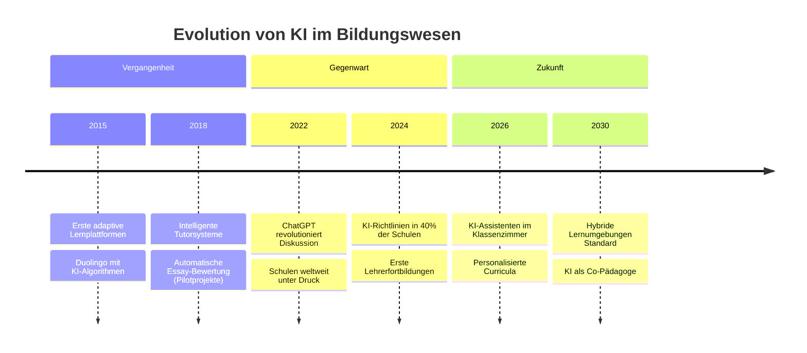

<!-- Slide 1: Impact Opening -->

  

    🤖
    📚
    🎓
    💡
    🧠
  

  

    

      
      Weiterbildung 2025
    

    <h1 class="hero-title">
      Künstliche Intelligenz
       
      in der Schulbildung
    </h1>

    

      Wie KI den Unterricht transformiert – und was das für Schulen bedeutet
    

    

      

        <AnimatedCounter :target="73" suffix="%" />
        der Lehrkräfte offen für KI
      

      

      

        <AnimatedCounter :target="42" suffix="%" />
        der Schulen nutzen bereits KI-Tools
      

      

      

        <AnimatedCounter :target="2030" :duration="2000" />
        globaler Wandel im Bildungswesen
      

    

  

  

    Space drücken
    
↓

  

---
transition: fade-out
---

# Agenda

  

    

      
01

      

        <h3>Chancen & Potenziale</h3>
        
Wie KI den Unterricht bereichern kann

      

    

    

      
02

      

        <h3>Risiken & Herausforderungen</h3>
        
Kritische Betrachtung der Technologie

      

    

    

      
03

      

        <h3>Datenschutz im Fokus</h3>
        
DSGVO-konforme Implementierung

      

    

    

      
04

      

        <h3>Praktische Anwendungen</h3>
        
Konkrete Tools und Methoden

      

    

    

      
05

      

        <h3>Zukunftsszenarien</h3>
        
Wie sieht Schule 2030 aus?

      

    

    

      
06

      

        <h3>Handlungsempfehlungen</h3>
        
Ihr Fahrplan für die Umsetzung

      

    

  

---
layout: ki-comparison
title: 'Chancen vs. Risiken von KI in der Bildung'
leftTitle: 'Chancen'
rightTitle: 'Risiken'
leftType: positive
rightType: negative
dividerStyle: vs
transition: slide-up
---

::left::

- **Personalisiertes Lernen** für jeden Schüler
- Sofortiges Feedback bei Aufgaben
- Entlastung bei Routineaufgaben
- Barrierefreier Zugang für alle
- 24/7 Lernunterstützung möglich
- Datenbasierte Lernfortschritte

::right::

- Datenschutz-Bedenken
- Gefahr der **Überabhängigkeit**
- Soziale Interaktion reduziert?
- Bias in KI-Systemen
- Kosten & Infrastruktur
- Lehrkräfte-Qualifizierung nötig

---
transition: slide-left
---

# Statistiken zur KI-Nutzung in deutschen Schulen

  

    

      <svg viewBox="0 0 100 100" class="progress-ring">
        <circle cx="50" cy="50" r="45" class="progress-bg"/>
        <circle cx="50" cy="50" r="45" class="progress-fill" style="--progress: 67;"/>
      </svg>
      
        <AnimatedCounter :target="67" suffix="%" :duration="1500" />
      
    

    <h3>Lehrkräfte</h3>
    
haben bereits von KI-Tools gehört oder sie ausprobiert

  

  

    

      <svg viewBox="0 0 100 100" class="progress-ring">
        <circle cx="50" cy="50" r="45" class="progress-bg"/>
        <circle cx="50" cy="50" r="45" class="progress-fill" style="--progress: 34;"/>
      </svg>
      
        <AnimatedCounter :target="34" suffix="%" :duration="1500" />
      
    

    <h3>Schulen</h3>
    
haben offizielle Richtlinien zum KI-Einsatz

  

  

    

      <svg viewBox="0 0 100 100" class="progress-ring">
        <circle cx="50" cy="50" r="45" class="progress-bg"/>
        <circle cx="50" cy="50" r="45" class="progress-fill" style="--progress: 89;"/>
      </svg>
      
        <AnimatedCounter :target="89" suffix="%" :duration="1500" />
      
    

    <h3>Schüler:innen</h3>
    
nutzen ChatGPT für Hausaufgaben (privat)

  

  

    

      <svg viewBox="0 0 100 100" class="progress-ring">
        <circle cx="50" cy="50" r="45" class="progress-bg"/>
        <circle cx="50" cy="50" r="45" class="progress-fill" style="--progress: 12;"/>
      </svg>
      
        <AnimatedCounter :target="12" suffix="%" :duration="1500" />
      
    

    <h3>Fortbildungen</h3>
    
behandeln aktuell KI-Kompetenz systematisch

  

  📊 Quellen: Bitkom Studie 2024, Deutsches Schulbarometer, GEW Umfrage

---
layout: ki-quiz
question: 'Welche KI-Anwendung ist am weitesten in deutschen Schulen verbreitet?'
options:
  - text: 'Adaptive Lernplattformen (z.B. bettermarks, Anton)'
    correct: true
    explanation: 'Richtig! Adaptive Lernplattformen sind bereits in ca. 30% der deutschen Schulen im Einsatz. Sie passen Übungen automatisch an das Lernniveau an.'
  - text: 'KI-gestützte Aufsatzbewertung'
    correct: false
    explanation: 'Nicht ganz. Automatische Textbewertung ist in Deutschland aus Datenschutzgründen nur eingeschränkt verbreitet.'
  - text: 'Virtuelle Lehrassistenten (Chatbots)'
    correct: false
    explanation: 'Chatbots sind noch wenig verbreitet. Viele Schulen haben Bedenken bezüglich Genauigkeit und Datenschutz.'
  - text: 'KI-Übersetzungstools im Sprachunterricht'
    correct: false
    explanation: 'Übersetzungstools werden genutzt, aber nicht so systematisch wie Lernplattformen.'
transition: fade
---

---
transition: slide-up
---

# Praktische KI-Anwendungen im Schulalltag

  

    <h3>📝 Unterrichtsvorbereitung</h3>
    

      

        🎯
        <h4>Lernziele generieren</h4>
        
KI erstellt differenzierte Lernziele basierend auf Lehrplan

      

      

        📋
        <h4>Arbeitsblätter</h4>
        
Automatische Erstellung von Übungsaufgaben

      

      

        🎨
        <h4>Visualisierungen</h4>
        
KI-generierte Bilder für komplexe Konzepte

      

    

  

  

    <h3>👥 Im Unterricht</h3>
    

      

        🤖
        <h4>Adaptive Lernpfade</h4>
        
Individuelle Förderung nach Lernstand

      

      

        🗣️
        <h4>Sprachassistenz</h4>
        
Aussprachetraining & Übersetzung

      

      

        ♿
        <h4>Barrierefreiheit</h4>
        
Text-to-Speech, Untertitel, Vereinfachung

      

    

  

  💭
  <strong>Reflexionsfrage:</strong> Welche dieser Anwendungen könnte in EURER Schule den größten Mehrwert bringen?

---
transition: fade
---

# Szenarien: KI-Implementierung in Schulen

<ScenarioSelector />

---
layout: ki-quiz
question: 'Was ist bei der Nutzung von ChatGPT mit Schülerdaten zu beachten?'
options:
  - text: 'Keine Bedenken - ChatGPT ist ein US-Unternehmen'
    correct: false
    explanation: 'Falsch! Gerade weil OpenAI ein US-Unternehmen ist, gelten strenge DSGVO-Anforderungen für Datenübermittlung.'
  - text: 'Personenbezogene Daten dürfen ohne Einwilligung nicht eingegeben werden'
    correct: true
    explanation: 'Richtig! Gemäß DSGVO dürfen keine personenbezogenen Schülerdaten ohne explizite Einwilligung an Drittanbieter übermittelt werden.'
  - text: 'Die Schulleitung entscheidet eigenständig über den Einsatz'
    correct: false
    explanation: 'Nicht korrekt. Der Datenschutzbeauftragte und die Schulaufsicht müssen eingebunden werden.'
  - text: 'Nur in der Oberstufe erlaubt'
    correct: false
    explanation: 'Es gibt keine generelle Altersbeschränkung - aber besondere Schutzpflichten für Minderjährige.'
transition: slide-left
---

---
transition: slide-up
---

# Datenschutz: Warum er bei KI zentral ist

  

    

      ⚠️
      <h3>Sensible Daten</h3>
      <ul>
        <li>Lernverhalten & -schwächen</li>
        <li>Noten & Beurteilungen</li>
        <li>Persönliche Texte</li>
        <li>Biometrische Daten (bei Proctoring)</li>
      </ul>
    

    

      📋
      <h3>DSGVO-Anforderungen</h3>
      <ul>
        <li>Auftragsverarbeitung (AV-Vertrag)</li>
        <li>Datenschutz-Folgenabschätzung</li>
        <li>Transparenz für Eltern/Schüler</li>
        <li>Recht auf Löschung</li>
      </ul>
    

    

      ✅
      <h3>Best Practices</h3>
      <ul>
        <li>Anonymisierte/Pseudonymisierte Daten</li>
        <li>EU-Server bevorzugen</li>
        <li>Datensparsamkeit leben</li>
        <li>Regelmäßige Audits</li>
      </ul>
    

  

  

    <blockquote>
      "Schüler sind besonders schutzbedürftig. Bei KI-Systemen müssen wir noch genauer hinschauen."
    </blockquote>
    <cite>— Bundesbeauftragter für Datenschutz</cite>
  

---
layout: ki-iframe
title: 'Datenschutz-Check: Analysieren Sie Ihre Schulplattformen'
url: 'https://datenschutzbestimmungs-check.vercel.app/'
height: '68%'
showUrl: true
transition: fade
---

  
🔍 Interaktives Tool

  
Dieses Analysetool hilft Ihnen, Datenschutzbestimmungen von Bildungs-Tools zu bewerten.

  

    <strong>Diskussionsimpuls:</strong> Wie transparent sind die Datenschutzbestimmungen eurer Schulplattformen?
  

---
transition: slide-left
---

# Pro & Contra: 3D-Karten-Übersicht

  <FlipCard
    v-click
    front-title="Personalisierung"
    front-icon="🎯"
    back-type="pro"
    back-content="KI ermöglicht maßgeschneiderte Lernpfade. Jeder Schüler lernt in eigenem Tempo mit passenden Aufgaben."
  />

  <FlipCard
    v-click
    front-title="Datenschutz"
    front-icon="🔒"
    back-type="contra"
    back-content="Umfangreiche Datensammlung über Lernverhalten. US-Cloud-Dienste ohne EU-Äquivalent. Transparenzprobleme."
  />

  <FlipCard
    v-click
    front-title="Entlastung"
    front-icon="⚡"
    back-type="pro"
    back-content="Routineaufgaben wie Korrektur, Feedback und Verwaltung können automatisiert werden. Mehr Zeit für Pädagogik."
  />

  <FlipCard
    v-click
    front-title="Abhängigkeit"
    front-icon="⚠️"
    back-type="contra"
    back-content="Risiko der Technologie-Abhängigkeit. Was passiert bei Systemausfällen? Kritisches Denken gefährdet?"
  />

  💡 <strong>Tipp:</strong> Klicken Sie auf die Karten, um sie zu drehen!

---
layout: ki-quiz
question: 'Wie sollten Schulen mit KI-generierten Schülerarbeiten umgehen?'
options:
  - text: 'Generelles Verbot von KI-Nutzung für Hausaufgaben'
    correct: false
    explanation: 'Verbote sind schwer durchsetzbar und kontraproduktiv. KI ist Teil der zukünftigen Arbeitswelt.'
  - text: 'KI-Kompetenz in den Lehrplan integrieren und transparente Regeln aufstellen'
    correct: true
    explanation: 'Richtig! Der beste Ansatz ist eine konstruktive Integration. Schüler lernen, KI als Werkzeug verantwortungsvoll zu nutzen.'
  - text: 'KI-Detektoren einsetzen und bei Verdacht sanktionieren'
    correct: false
    explanation: 'KI-Detektoren sind unzuverlässig (hohe Fehlerquote). Sanktionen allein lösen das pädagogische Problem nicht.'
  - text: 'Nur mündliche Prüfungen durchführen'
    correct: false
    explanation: 'Mündliche Prüfungen sind wichtig, aber schriftliche Kompetenzen müssen ebenfalls gefördert werden.'
transition: fade
---

---
transition: slide-up
---

# Zeitstrahl: KI in der Bildung

  🔮
  

    <strong>Einordnung:</strong> Wir stehen am Anfang einer Transformation, die sich in den nächsten 5 Jahren beschleunigen wird. Jetzt ist der Zeitpunkt für strategische Weichenstellungen.
  

---
layout: ki-quiz
question: 'Was sollte eine Schule VOR der Einführung eines KI-Tools unbedingt prüfen?'
options:
  - text: 'Nur die Kosten und Benutzerfreundlichkeit'
    correct: false
    explanation: 'Kosten und Usability sind wichtig, aber Datenschutz und pädagogischer Mehrwert müssen Priorität haben.'
  - text: 'AV-Vertrag, Serverstandort, DSGVO-Konformität und pädagogisches Konzept'
    correct: true
    explanation: 'Genau richtig! Diese vier Säulen bilden das Fundament für einen verantwortungsvollen KI-Einsatz in Schulen.'
  - text: 'Ob andere Schulen das Tool bereits nutzen'
    correct: false
    explanation: 'Verbreitung ist kein Qualitätsmerkmal. Jede Schule muss die eigene Prüfung durchführen.'
  - text: 'Die Empfehlung des KI-Herstellers'
    correct: false
    explanation: 'Herstellerempfehlungen sind subjektiv und verfolgen wirtschaftliche Interessen.'
transition: slide-left
---

---
transition: fade
---

# Case Study: Gymnasium München-Süd

  

    
📚 Praxisbeispiel

    <h2>KI-Integration in 3 Phasen</h2>
  

  

    

      
1

      

        <h3>Pilotphase (3 Monate)</h3>
        <ul>
          <li>2 Lehrkräfte, 1 Fach (Mathematik)</li>
          <li>Adaptive Lernplattform "bettermarks"</li>
          <li>Datenschutz-Prüfung abgeschlossen</li>
        </ul>
        

          +23% Lernfortschritt in Pilotklassen
        

      

    

    

      
2

      

        <h3>Ausweitung (6 Monate)</h3>
        <ul>
          <li>15 Lehrkräfte, 4 Fächer</li>
          <li>Lehrerfortbildung: 12 Stunden</li>
          <li>Eltern-Informationsabend</li>
        </ul>
        

          85% Akzeptanz bei Eltern
        

      

    

    

      
3

      

        <h3>Etablierung (heute)</h3>
        <ul>
          <li>Schulweite KI-Richtlinie verabschiedet</li>
          <li>KI-Lotsen im Kollegium benannt</li>
          <li>Regelmäßige Evaluation</li>
        </ul>
        

          A+ Datenschutz-Audit bestanden
        

      

    

  

  

    <h4>🎯 Key Learnings</h4>
    

      Klein starten
      Kollegium einbinden
      Transparent kommunizieren
      Kontinuierlich evaluieren
    

  

---
transition: slide-up
---

# Handlungsempfehlungen für Ihre Schule

  

    

      
1

      

        <h3>Task Force bilden</h3>
        
2-3 technikaffine Lehrkräfte + Schulleitung + Datenschutzbeauftragter

        
⏱️ Sofort umsetzbar

      

    

    

      
2

      

        <h3>Bestandsaufnahme</h3>
        
Welche KI-Tools werden bereits (inoffiziell) genutzt? Wo gibt es Bedarf?

        
⏱️ 2-4 Wochen

      

    

    

      
3

      

        <h3>Richtlinie entwerfen</h3>
        
Klare Regeln für Lehrkräfte UND Schüler:innen zur KI-Nutzung

        
⏱️ 4-6 Wochen

      

    

    

      
4

      

        <h3>Pilotprojekt starten</h3>
        
Ein Fach, ein Tool, klare Evaluation – klein anfangen, groß denken

        
⏱️ 1 Schulhalbjahr

      

    

    

      
5

      

        <h3>Fortbildung sichern</h3>
        
Regelmäßige Schulungen für das gesamte Kollegium – intern und extern

        
⏱️ Kontinuierlich

      

    

    

      
6

      

        <h3>Austausch suchen</h3>
        
Netzwerke mit anderen Schulen bilden – voneinander lernen!

        
⏱️ Ab sofort

      

    

  

---
layout: center
class: text-center
transition: fade
---

  
🚀

  <h1 class="closing-title">
    Die Zukunft der Bildung 
    gestalten wir gemeinsam
  </h1>

  

    KI ist kein Ersatz für gute Pädagogik – sie ist ein Werkzeug, 
    das uns helfen kann, <strong>noch besser zu unterrichten</strong>.
  

  

    

      💬
      Fragen & Diskussion
    

    

    

      📧
      Kontakt für Rückfragen
    

    

    

      📚
      Weiterführende Ressourcen
    

  

  

    Vielen Dank für Ihre Aufmerksamkeit!
  

