<style>
/* Import der globalen Styles */
@import './styles/main.css';
</style>

<!-- Slide 1: Impact Opening -->
<div class="hero-slide">
  <div class="floating-icons">
    <span class="float-icon icon-1">🤖</span>
    <span class="float-icon icon-2">📚</span>
    <span class="float-icon icon-3">🎓</span>
    <span class="float-icon icon-4">💡</span>
    <span class="float-icon icon-5">🧠</span>
  </div>

  <div class="hero-content">
    <div class="hero-badge">
      <span class="pulse-dot"></span>
      Weiterbildung 2025
    </div>
    <h1 class="hero-title">
      <span class="gradient-text">Künstliche Intelligenz</span>
      <br>
      <span class="subtitle-text">in der Schulbildung</span>
    </h1>
    <p class="hero-description">
      Wie KI den Unterricht transformiert – und was das für Schulen bedeutet
    </p>
    <div class="hero-stats">
      <div class="stat-item">
        <AnimatedCounter :target="73" suffix="%" />
        <span class="stat-label">der Lehrkräfte<br>offen für KI</span>
      </div>
      <div class="stat-divider"></div>
      <div class="stat-item">
        <AnimatedCounter :target="42" suffix="%" />
        <span class="stat-label">der Schulen nutzen<br>bereits KI-Tools</span>
      </div>
      <div class="stat-divider"></div>
      <div class="stat-item">
        <AnimatedCounter :target="2030" :duration="2000" />
        <span class="stat-label">globaler Wandel<br>im Bildungswesen</span>
      </div>
    </div>
  </div>

  <div class="scroll-indicator">
    <span>Space drücken</span>
    <div class="arrow-bounce">↓</div>
  </div>
</div>

<style>
.hero-slide {
  height: 100%;
  display: flex;
  flex-direction: column;
  align-items: center;
  justify-content: center;
  background: linear-gradient(135deg, #1a1a2e 0%, #16213e 50%, #0f3460 100%);
  position: relative;
  overflow: hidden;
}

.hero-slide::before {
  content: '';
  position: absolute;
  top: -50%;
  left: -50%;
  width: 200%;
  height: 200%;
  background: radial-gradient(circle at 30% 30%, rgba(99, 102, 241, 0.15) 0%, transparent 50%),
              radial-gradient(circle at 70% 70%, rgba(168, 85, 247, 0.15) 0%, transparent 50%);
  animation: gradientMove 15s ease-in-out infinite;
}

@keyframes gradientMove {
  0%, 100% { transform: translate(0, 0) rotate(0deg); }
  50% { transform: translate(5%, 5%) rotate(5deg); }
}

.floating-icons {
  position: absolute;
  width: 100%;
  height: 100%;
  pointer-events: none;
}

.float-icon {
  position: absolute;
  font-size: 2.5rem;
  opacity: 0.3;
  animation: float 6s ease-in-out infinite;
}

.icon-1 { top: 15%; left: 10%; animation-delay: 0s; }
.icon-2 { top: 25%; right: 15%; animation-delay: 1s; }
.icon-3 { bottom: 30%; left: 8%; animation-delay: 2s; }
.icon-4 { bottom: 20%; right: 10%; animation-delay: 3s; }
.icon-5 { top: 60%; left: 85%; animation-delay: 4s; }

@keyframes float {
  0%, 100% { transform: translateY(0) rotate(0deg); }
  50% { transform: translateY(-20px) rotate(5deg); }
}

.hero-content {
  position: relative;
  z-index: 10;
  text-align: center;
  max-width: 900px;
  padding: 0 2rem;
}

.hero-badge {
  display: inline-flex;
  align-items: center;
  gap: 0.5rem;
  background: rgba(255, 255, 255, 0.1);
  backdrop-filter: blur(10px);
  border: 1px solid rgba(255, 255, 255, 0.2);
  padding: 0.5rem 1.25rem;
  border-radius: 2rem;
  font-size: 0.875rem;
  color: rgba(255, 255, 255, 0.9);
  margin-bottom: 2rem;
  animation: fadeInUp 0.8s ease-out;
}

.pulse-dot {
  width: 8px;
  height: 8px;
  background: #22c55e;
  border-radius: 50%;
  animation: pulse 2s ease-in-out infinite;
}

@keyframes pulse {
  0%, 100% { opacity: 1; transform: scale(1); }
  50% { opacity: 0.5; transform: scale(1.2); }
}

.hero-title {
  font-size: 4rem;
  font-weight: 800;
  line-height: 1.1;
  margin: 0 0 1.5rem 0;
  animation: fadeInUp 0.8s ease-out 0.2s both;
}

.gradient-text {
  background: linear-gradient(135deg, #60a5fa, #a78bfa, #f472b6);
  -webkit-background-clip: text;
  -webkit-text-fill-color: transparent;
  background-clip: text;
}

.subtitle-text {
  color: rgba(255, 255, 255, 0.95);
  font-size: 0.7em;
}

.hero-description {
  font-size: 1.35rem;
  color: rgba(255, 255, 255, 0.7);
  margin: 0 0 3rem 0;
  animation: fadeInUp 0.8s ease-out 0.4s both;
}

.hero-stats {
  display: flex;
  justify-content: center;
  align-items: center;
  gap: 2.5rem;
  animation: fadeInUp 0.8s ease-out 0.6s both;
}

.stat-item {
  text-align: center;
}

.stat-item :deep(.animated-counter) {
  font-size: 2.5rem;
  font-weight: 700;
  color: white;
  display: block;
}

.stat-label {
  font-size: 0.8rem;
  color: rgba(255, 255, 255, 0.6);
  line-height: 1.3;
  display: block;
  margin-top: 0.25rem;
}

.stat-divider {
  width: 1px;
  height: 50px;
  background: rgba(255, 255, 255, 0.2);
}

@keyframes fadeInUp {
  from {
    opacity: 0;
    transform: translateY(30px);
  }
  to {
    opacity: 1;
    transform: translateY(0);
  }
}

.scroll-indicator {
  position: absolute;
  bottom: 2rem;
  display: flex;
  flex-direction: column;
  align-items: center;
  gap: 0.5rem;
  color: rgba(255, 255, 255, 0.5);
  font-size: 0.75rem;
  animation: fadeIn 1s ease-out 1.5s both;
}

.arrow-bounce {
  animation: bounce 2s ease-in-out infinite;
}

@keyframes bounce {
  0%, 100% { transform: translateY(0); }
  50% { transform: translateY(8px); }
}

@keyframes fadeIn {
  from { opacity: 0; }
  to { opacity: 1; }
}
</style>

---
transition: fade-out
---

# Agenda

<div class="agenda-container">
  <div class="agenda-grid">
    <div v-click class="agenda-item">
      <div class="agenda-number">01</div>
      <div class="agenda-content">
        <h3>Chancen & Potenziale</h3>
        <p>Wie KI den Unterricht bereichern kann</p>
      </div>
    </div>
    <div v-click class="agenda-item">
      <div class="agenda-number">02</div>
      <div class="agenda-content">
        <h3>Risiken & Herausforderungen</h3>
        <p>Kritische Betrachtung der Technologie</p>
      </div>
    </div>
    <div v-click class="agenda-item">
      <div class="agenda-number">03</div>
      <div class="agenda-content">
        <h3>Datenschutz im Fokus</h3>
        <p>DSGVO-konforme Implementierung</p>
      </div>
    </div>
    <div v-click class="agenda-item">
      <div class="agenda-number">04</div>
      <div class="agenda-content">
        <h3>Praktische Anwendungen</h3>
        <p>Konkrete Tools und Methoden</p>
      </div>
    </div>
    <div v-click class="agenda-item">
      <div class="agenda-number">05</div>
      <div class="agenda-content">
        <h3>Zukunftsszenarien</h3>
        <p>Wie sieht Schule 2030 aus?</p>
      </div>
    </div>
    <div v-click class="agenda-item highlight">
      <div class="agenda-number">06</div>
      <div class="agenda-content">
        <h3>Handlungsempfehlungen</h3>
        <p>Ihr Fahrplan für die Umsetzung</p>
      </div>
    </div>
  </div>
</div>

<style>
.agenda-container {
  padding: 2rem;
}

.agenda-grid {
  display: grid;
  grid-template-columns: repeat(2, 1fr);
  gap: 1.5rem;
  max-width: 900px;
  margin: 0 auto;
}

.agenda-item {
  display: flex;
  gap: 1rem;
  padding: 1.25rem;
  background: white;
  border-radius: 1rem;
  box-shadow: 0 4px 15px rgba(0, 0, 0, 0.05);
  border: 1px solid #e5e7eb;
  transition: all 0.3s ease;
}

.agenda-item:hover {
  transform: translateY(-4px);
  box-shadow: 0 8px 25px rgba(0, 0, 0, 0.1);
  border-color: #6366f1;
}

.agenda-item.highlight {
  background: linear-gradient(135deg, #6366f1, #8b5cf6);
  border: none;
}

.agenda-item.highlight .agenda-number,
.agenda-item.highlight h3,
.agenda-item.highlight p {
  color: white;
}

.agenda-item.highlight .agenda-number {
  background: rgba(255, 255, 255, 0.2);
}

.agenda-number {
  width: 3rem;
  height: 3rem;
  display: flex;
  align-items: center;
  justify-content: center;
  background: linear-gradient(135deg, #f0f1ff, #e5e7eb);
  border-radius: 0.75rem;
  font-weight: 700;
  font-size: 1.1rem;
  color: #6366f1;
  flex-shrink: 0;
}

.agenda-content h3 {
  font-size: 1.1rem;
  font-weight: 600;
  margin: 0 0 0.25rem 0;
  color: #1f2937;
}

.agenda-content p {
  font-size: 0.875rem;
  margin: 0;
  color: #6b7280;
}
</style>

---
layout: ki-comparison
title: 'Chancen vs. Risiken von KI in der Bildung'
leftTitle: 'Chancen'
rightTitle: 'Risiken'
leftType: positive
rightType: negative
dividerStyle: vs
transition: slide-up
---

::left::

<div v-click class="comparison-item positive-item">
  <span class="item-icon">✓</span>
  <span class="item-text"><strong>Personalisiertes Lernen</strong> für jeden Schüler</span>
</div>

<div v-click class="comparison-item positive-item">
  <span class="item-icon">✓</span>
  <span class="item-text">Sofortiges Feedback bei Aufgaben</span>
</div>

<div v-click class="comparison-item positive-item">
  <span class="item-icon">✓</span>
  <span class="item-text">Entlastung bei Routineaufgaben</span>
</div>

<div v-click class="comparison-item positive-item">
  <span class="item-icon">✓</span>
  <span class="item-text">Barrierefreier Zugang für alle</span>
</div>

<div v-click class="comparison-item positive-item">
  <span class="item-icon">✓</span>
  <span class="item-text">24/7 Lernunterstützung möglich</span>
</div>

<div v-click class="comparison-item positive-item">
  <span class="item-icon">✓</span>
  <span class="item-text">Datenbasierte Lernfortschritte</span>
</div>

::right::

<div v-click class="comparison-item negative-item">
  <span class="item-icon">✗</span>
  <span class="item-text">Datenschutz-Bedenken</span>
</div>

<div v-click class="comparison-item negative-item">
  <span class="item-icon">✗</span>
  <span class="item-text">Gefahr der <strong>Überabhängigkeit</strong></span>
</div>

<div v-click class="comparison-item negative-item">
  <span class="item-icon">✗</span>
  <span class="item-text">Soziale Interaktion reduziert?</span>
</div>

<div v-click class="comparison-item negative-item">
  <span class="item-icon">✗</span>
  <span class="item-text">Bias in KI-Systemen</span>
</div>

<div v-click class="comparison-item negative-item">
  <span class="item-icon">✗</span>
  <span class="item-text">Kosten & Infrastruktur</span>
</div>

<div v-click class="comparison-item negative-item">
  <span class="item-icon">✗</span>
  <span class="item-text">Lehrkräfte-Qualifizierung nötig</span>
</div>

<style>
.comparison-item {
  display: flex;
  align-items: flex-start;
  gap: 0.75rem;
  padding: 0.6rem 0;
  border-bottom: 1px solid rgba(0,0,0,0.05);
}
.comparison-item:last-child {
  border-bottom: none;
}
.item-icon {
  font-weight: 700;
  font-size: 1.1rem;
  flex-shrink: 0;
  width: 1.5rem;
}
.positive-item .item-icon {
  color: #34C759;
}
.negative-item .item-icon {
  color: #FF3B30;
}
.item-text {
  font-size: 1rem;
  line-height: 1.4;
  color: #1D1D1F;
}
</style>

---
transition: slide-left
---

# Statistiken zur KI-Nutzung in deutschen Schulen

<div class="stats-grid">
  <div v-click class="stat-card animate-on-click">
    <div class="stat-visual">
      <svg viewBox="0 0 100 100" class="progress-ring">
        <circle cx="50" cy="50" r="45" class="progress-bg"/>
        <circle cx="50" cy="50" r="45" class="progress-fill" style="--progress: 67;"/>
      </svg>
      <span class="stat-value">
        <AnimatedCounter :target="67" suffix="%" :duration="1500" />
      </span>
    </div>
    <h3>Lehrkräfte</h3>
    <p>haben bereits von KI-Tools gehört oder sie ausprobiert</p>
  </div>

  <div v-click class="stat-card animate-on-click">
    <div class="stat-visual">
      <svg viewBox="0 0 100 100" class="progress-ring">
        <circle cx="50" cy="50" r="45" class="progress-bg"/>
        <circle cx="50" cy="50" r="45" class="progress-fill" style="--progress: 34;"/>
      </svg>
      <span class="stat-value">
        <AnimatedCounter :target="34" suffix="%" :duration="1500" />
      </span>
    </div>
    <h3>Schulen</h3>
    <p>haben offizielle Richtlinien zum KI-Einsatz</p>
  </div>

  <div v-click class="stat-card animate-on-click">
    <div class="stat-visual">
      <svg viewBox="0 0 100 100" class="progress-ring">
        <circle cx="50" cy="50" r="45" class="progress-bg"/>
        <circle cx="50" cy="50" r="45" class="progress-fill" style="--progress: 89;"/>
      </svg>
      <span class="stat-value">
        <AnimatedCounter :target="89" suffix="%" :duration="1500" />
      </span>
    </div>
    <h3>Schüler:innen</h3>
    <p>nutzen ChatGPT für Hausaufgaben (privat)</p>
  </div>

  <div v-click class="stat-card accent animate-on-click">
    <div class="stat-visual">
      <svg viewBox="0 0 100 100" class="progress-ring">
        <circle cx="50" cy="50" r="45" class="progress-bg"/>
        <circle cx="50" cy="50" r="45" class="progress-fill" style="--progress: 12;"/>
      </svg>
      <span class="stat-value">
        <AnimatedCounter :target="12" suffix="%" :duration="1500" />
      </span>
    </div>
    <h3>Fortbildungen</h3>
    <p>behandeln aktuell KI-Kompetenz systematisch</p>
  </div>
</div>

<div v-click class="stats-source">
  Quellen: Bitkom Studie 2024, Deutsches Schulbarometer, GEW Umfrage
</div>

<style>
.stats-grid {
  display: grid;
  grid-template-columns: repeat(4, 1fr);
  gap: 1.5rem;
  padding: 1rem 2rem;
}

.stat-card {
  background: white;
  border-radius: 1rem;
  padding: 1.5rem;
  text-align: center;
  box-shadow: 0 4px 20px rgba(0, 0, 0, 0.06);
  border: 1px solid #e5e7eb;
  transition: all 0.3s ease;
}

.stat-card:hover {
  transform: translateY(-5px);
  box-shadow: 0 10px 30px rgba(0, 0, 0, 0.1);
}

.stat-card.accent {
  background: linear-gradient(135deg, #fef3c7, #fde68a);
  border-color: #f59e0b;
}

.stat-visual {
  position: relative;
  width: 100px;
  height: 100px;
  margin: 0 auto 1rem;
}

.progress-ring {
  transform: rotate(-90deg);
}

.progress-bg {
  fill: none;
  stroke: #e5e7eb;
  stroke-width: 8;
}

/* Animation startet erst wenn das Element sichtbar wird */
.progress-fill {
  fill: none;
  stroke: #6366f1;
  stroke-width: 8;
  stroke-linecap: round;
  stroke-dasharray: 283;
  stroke-dashoffset: 283; /* Start bei 0% */
  transition: none;
}

/* Animation wenn v-click aktiv ist */
.animate-on-click.slidev-vclick-current .progress-fill,
.animate-on-click.slidev-vclick-prior .progress-fill {
  stroke-dashoffset: calc(283 - (283 * var(--progress)) / 100);
  transition: stroke-dashoffset 1.5s ease-out;
}

.stat-card.accent .progress-fill {
  stroke: #f59e0b;
}

.stat-value {
  position: absolute;
  top: 50%;
  left: 50%;
  transform: translate(-50%, -50%);
  font-size: 1.5rem;
  font-weight: 700;
  color: #1f2937;
}

.stat-card h3 {
  font-size: 1rem;
  font-weight: 600;
  color: #1f2937;
  margin: 0 0 0.5rem 0;
}

.stat-card p {
  font-size: 0.8rem;
  color: #6b7280;
  margin: 0;
  line-height: 1.4;
}

.stats-source {
  text-align: center;
  margin-top: 2rem;
  padding: 0.75rem 1.5rem;
  background: #f9fafb;
  border-radius: 0.5rem;
  font-size: 0.75rem;
  color: #6b7280;
}
</style>

---
layout: ki-quiz
question: 'Welche KI-Anwendung ist am weitesten in deutschen Schulen verbreitet?'
options:
  - text: 'Adaptive Lernplattformen (z.B. bettermarks, Anton)'
    correct: true
    explanation: 'Richtig! Adaptive Lernplattformen sind bereits in ca. 30% der deutschen Schulen im Einsatz. Sie passen Übungen automatisch an das Lernniveau an.'
  - text: 'KI-gestützte Aufsatzbewertung'
    correct: false
    explanation: 'Nicht ganz. Automatische Textbewertung ist in Deutschland aus Datenschutzgründen nur eingeschränkt verbreitet.'
  - text: 'Virtuelle Lehrassistenten (Chatbots)'
    correct: false
    explanation: 'Chatbots sind noch wenig verbreitet. Viele Schulen haben Bedenken bezüglich Genauigkeit und Datenschutz.'
  - text: 'KI-Übersetzungstools im Sprachunterricht'
    correct: false
    explanation: 'Übersetzungstools werden genutzt, aber nicht so systematisch wie Lernplattformen.'
transition: fade
---

---
layout: ki-scrollable
transition: slide-up
title: Praktische KI-Anwendungen im Schulalltag
---

<div class="apps-showcase">
  <div class="app-category">
    <h3>Unterrichtsvorbereitung</h3>
    <div class="app-cards">
      <div v-click class="app-card">
        <span class="app-icon">🎯</span>
        <h4>Lernziele generieren</h4>
        <p>KI erstellt differenzierte Lernziele basierend auf Lehrplan</p>
      </div>
      <div v-click class="app-card">
        <span class="app-icon">📋</span>
        <h4>Arbeitsblätter</h4>
        <p>Automatische Erstellung von Übungsaufgaben</p>
      </div>
      <div v-click class="app-card">
        <span class="app-icon">🎨</span>
        <h4>Visualisierungen</h4>
        <p>KI-generierte Bilder für komplexe Konzepte</p>
      </div>
    </div>
  </div>

  <div class="app-category">
    <h3>Im Unterricht</h3>
    <div class="app-cards">
      <div v-click class="app-card highlight">
        <span class="app-icon">🤖</span>
        <h4>Adaptive Lernpfade</h4>
        <p>Individuelle Förderung nach Lernstand</p>
      </div>
      <div v-click class="app-card">
        <span class="app-icon">🗣️</span>
        <h4>Sprachassistenz</h4>
        <p>Aussprachetraining & Übersetzung</p>
      </div>
      <div v-click class="app-card">
        <span class="app-icon">♿</span>
        <h4>Barrierefreiheit</h4>
        <p>Text-to-Speech, Untertitel, Vereinfachung</p>
      </div>
    </div>
  </div>

  <div v-click class="reflection-box">
    <span class="reflection-icon">💭</span>
    <strong>Reflexionsfrage:</strong> Welche dieser Anwendungen könnte in EURER Schule den größten Mehrwert bringen?
  </div>
</div>

<style>
.apps-showcase {
  display: grid;
  gap: 1.5rem;
}

.app-category h3 {
  font-size: 1.1rem;
  margin-bottom: 0.75rem;
  color: #1f2937;
}

.app-cards {
  display: grid;
  grid-template-columns: repeat(3, 1fr);
  gap: 0.75rem;
}

.app-card {
  background: white;
  border-radius: 0.75rem;
  padding: 1rem;
  border: 1px solid #e5e7eb;
  transition: all 0.3s ease;
}

.app-card:hover {
  transform: translateY(-2px);
  box-shadow: 0 4px 15px rgba(0, 0, 0, 0.1);
  border-color: #6366f1;
}

.app-card.highlight {
  background: linear-gradient(135deg, #eef2ff, #e0e7ff);
  border-color: #6366f1;
}

.app-icon {
  font-size: 1.5rem;
  display: block;
  margin-bottom: 0.5rem;
}

.app-card h4 {
  font-size: 0.9rem;
  font-weight: 600;
  margin: 0 0 0.25rem 0;
  color: #1f2937;
}

.app-card p {
  font-size: 0.75rem;
  color: #6b7280;
  margin: 0;
  line-height: 1.3;
}

.reflection-box {
  display: flex;
  align-items: center;
  gap: 0.75rem;
  background: linear-gradient(135deg, #fef3c7, #fef9c3);
  border: 1px solid #fbbf24;
  border-radius: 0.75rem;
  padding: 0.75rem 1rem;
  font-size: 0.85rem;
}

.reflection-icon {
  font-size: 1.25rem;
}
</style>

---
layout: ki-scrollable
transition: fade
title: "Szenarien: KI-Implementierung in Schulen"
---

<ScenarioSelector />

---
layout: ki-quiz
question: 'Was ist bei der Nutzung von ChatGPT mit Schülerdaten zu beachten?'
options:
  - text: 'Keine Bedenken - ChatGPT ist ein US-Unternehmen'
    correct: false
    explanation: 'Falsch! Gerade weil OpenAI ein US-Unternehmen ist, gelten strenge DSGVO-Anforderungen für Datenübermittlung.'
  - text: 'Personenbezogene Daten dürfen ohne Einwilligung nicht eingegeben werden'
    correct: true
    explanation: 'Richtig! Gemäß DSGVO dürfen keine personenbezogenen Schülerdaten ohne explizite Einwilligung an Drittanbieter übermittelt werden.'
  - text: 'Die Schulleitung entscheidet eigenständig über den Einsatz'
    correct: false
    explanation: 'Nicht korrekt. Der Datenschutzbeauftragte und die Schulaufsicht müssen eingebunden werden.'
  - text: 'Nur in der Oberstufe erlaubt'
    correct: false
    explanation: 'Es gibt keine generelle Altersbeschränkung - aber besondere Schutzpflichten für Minderjährige.'
transition: slide-left
---

---
transition: slide-up
---

# Datenschutz: Warum er bei KI zentral ist

<div class="privacy-content">
  <div class="privacy-grid">
    <div v-click class="privacy-card warning">
      <span class="card-icon">⚠️</span>
      <h3>Sensible Daten</h3>
      <ul>
        <li>Lernverhalten & -schwächen</li>
        <li>Noten & Beurteilungen</li>
        <li>Persönliche Texte</li>
        <li>Biometrische Daten (bei Proctoring)</li>
      </ul>
    </div>
    <div v-click class="privacy-card info">
      <span class="card-icon">📋</span>
      <h3>DSGVO-Anforderungen</h3>
      <ul>
        <li>Auftragsverarbeitung (AV-Vertrag)</li>
        <li>Datenschutz-Folgenabschätzung</li>
        <li>Transparenz für Eltern/Schüler</li>
        <li>Recht auf Löschung</li>
      </ul>
    </div>
    <div v-click class="privacy-card success">
      <span class="card-icon">✅</span>
      <h3>Best Practices</h3>
      <ul>
        <li>Anonymisierte/Pseudonymisierte Daten</li>
        <li>EU-Server bevorzugen</li>
        <li>Datensparsamkeit leben</li>
        <li>Regelmäßige Audits</li>
      </ul>
    </div>
  </div>

  <div v-click class="privacy-quote">
    <blockquote>
      "Schüler sind besonders schutzbedürftig. Bei KI-Systemen müssen wir noch genauer hinschauen."
    </blockquote>
    <cite>— Bundesbeauftragter für Datenschutz</cite>
  </div>
</div>

<style>
.privacy-content {
  padding: 1rem;
}

.privacy-grid {
  display: grid;
  grid-template-columns: repeat(3, 1fr);
  gap: 1.5rem;
  margin-bottom: 2rem;
}

.privacy-card {
  background: white;
  border-radius: 1rem;
  padding: 1.5rem;
  box-shadow: 0 4px 15px rgba(0, 0, 0, 0.05);
}

.privacy-card.warning {
  border-left: 4px solid #ef4444;
}

.privacy-card.info {
  border-left: 4px solid #3b82f6;
}

.privacy-card.success {
  border-left: 4px solid #22c55e;
}

.card-icon {
  font-size: 2rem;
  display: block;
  margin-bottom: 0.75rem;
}

.privacy-card h3 {
  font-size: 1.1rem;
  font-weight: 600;
  margin: 0 0 1rem 0;
  color: #1f2937;
}

.privacy-card ul {
  list-style: none;
  padding: 0;
  margin: 0;
}

.privacy-card ul li {
  padding: 0.5rem 0;
  padding-left: 1.25rem;
  position: relative;
  font-size: 0.9rem;
  color: #4b5563;
}

.privacy-card ul li::before {
  content: "•";
  position: absolute;
  left: 0;
  color: #9ca3af;
}

.privacy-quote {
  background: linear-gradient(135deg, #f9fafb, #f3f4f6);
  border-radius: 1rem;
  padding: 1.5rem 2rem;
  text-align: center;
}

.privacy-quote blockquote {
  font-size: 1.25rem;
  font-style: italic;
  color: #374151;
  margin: 0 0 0.75rem 0;
  line-height: 1.5;
}

.privacy-quote cite {
  font-size: 0.9rem;
  color: #6b7280;
}
</style>

---
layout: ki-iframe
url: 'https://datenschutzbestimmungs-check.vercel.app/'
fullscreen: true
transition: fade
---

---
transition: slide-left
---

# Pro & Contra: 3D-Karten-Übersicht

<div class="flip-cards-container">
  <FlipCard
    v-click
    front-title="Personalisierung"
    front-icon="🎯"
    back-type="pro"
    back-content="KI ermöglicht maßgeschneiderte Lernpfade. Jeder Schüler lernt in eigenem Tempo mit passenden Aufgaben."
  />

  <FlipCard
    v-click
    front-title="Datenschutz"
    front-icon="🔒"
    back-type="contra"
    back-content="Umfangreiche Datensammlung über Lernverhalten. US-Cloud-Dienste ohne EU-Äquivalent. Transparenzprobleme."
  />

  <FlipCard
    v-click
    front-title="Entlastung"
    front-icon="⚡"
    back-type="pro"
    back-content="Routineaufgaben wie Korrektur, Feedback und Verwaltung können automatisiert werden. Mehr Zeit für Pädagogik."
  />
</div>

<div v-click class="flip-hint">
  Klicken Sie auf die Karten, um sie zu drehen!
</div>

<style>
.flip-cards-container {
  display: grid;
  grid-template-columns: repeat(3, 1fr);
  gap: 1.5rem;
  padding: 0.5rem 2rem;
  perspective: 1000px;
  height: calc(100% - 120px);
  align-items: center;
}

.flip-hint {
  text-align: center;
  padding: 0.5rem 1rem;
  background: #f3f4f6;
  border-radius: 0.5rem;
  font-size: 0.8rem;
  color: #6b7280;
  margin-top: 0.5rem;
}
</style>

---
layout: ki-quiz
question: 'Wie sollten Schulen mit KI-generierten Schülerarbeiten umgehen?'
options:
  - text: 'Generelles Verbot von KI-Nutzung für Hausaufgaben'
    correct: false
    explanation: 'Verbote sind schwer durchsetzbar und kontraproduktiv. KI ist Teil der zukünftigen Arbeitswelt.'
  - text: 'KI-Kompetenz in den Lehrplan integrieren und transparente Regeln aufstellen'
    correct: true
    explanation: 'Richtig! Der beste Ansatz ist eine konstruktive Integration. Schüler lernen, KI als Werkzeug verantwortungsvoll zu nutzen.'
  - text: 'KI-Detektoren einsetzen und bei Verdacht sanktionieren'
    correct: false
    explanation: 'KI-Detektoren sind unzuverlässig (hohe Fehlerquote). Sanktionen allein lösen das pädagogische Problem nicht.'
  - text: 'Nur mündliche Prüfungen durchführen'
    correct: false
    explanation: 'Mündliche Prüfungen sind wichtig, aber schriftliche Kompetenzen müssen ebenfalls gefördert werden.'
transition: fade
---

---
transition: slide-up
---

# Zeitstrahl: KI in der Bildung

```mermaid {scale: 0.5, theme: 'neutral'}
timeline
    title Evolution von KI im Bildungswesen
    section Vergangenheit
        2015 : Erste adaptive Lernplattformen
             : Duolingo mit KI-Algorithmen
        2018 : Intelligente Tutorsysteme
             : Automatische Essay-Bewertung (Pilotprojekte)
    section Gegenwart
        2022 : ChatGPT revolutioniert Diskussion
             : Schulen weltweit unter Druck
        2024 : KI-Richtlinien in 40% der Schulen
             : Erste Lehrerfortbildungen
    section Zukunft
        2026 : KI-Assistenten im Klassenzimmer
             : Personalisierte Curricula
        2030 : Hybride Lernumgebungen Standard
             : KI als Co-Pädagoge
```



<div v-click class="timeline-insight">
  <span class="insight-icon">🔮</span>
  <div class="insight-content">
    <strong>Einordnung:</strong> Wir stehen am Anfang einer Transformation, die sich in den nächsten 5 Jahren beschleunigen wird. Jetzt ist der Zeitpunkt für strategische Weichenstellungen.
  </div>
</div>

<style>
.timeline-insight {
  display: flex;
  align-items: flex-start;
  gap: 1rem;
  background: linear-gradient(135deg, #eff6ff, #dbeafe);
  border: 1px solid #3b82f6;
  border-radius: 1rem;
  padding: 1.25rem;
  margin-top: 1.5rem;
}

.insight-icon {
  font-size: 1.5rem;
}

.insight-content {
  font-size: 0.95rem;
  line-height: 1.5;
  color: #1e40af;
}
</style>

---
layout: ki-quiz
question: 'Was sollte eine Schule VOR der Einführung eines KI-Tools unbedingt prüfen?'
options:
  - text: 'Nur die Kosten und Benutzerfreundlichkeit'
    correct: false
    explanation: 'Kosten und Usability sind wichtig, aber Datenschutz und pädagogischer Mehrwert müssen Priorität haben.'
  - text: 'AV-Vertrag, Serverstandort, DSGVO-Konformität und pädagogisches Konzept'
    correct: true
    explanation: 'Genau richtig! Diese vier Säulen bilden das Fundament für einen verantwortungsvollen KI-Einsatz in Schulen.'
  - text: 'Ob andere Schulen das Tool bereits nutzen'
    correct: false
    explanation: 'Verbreitung ist kein Qualitätsmerkmal. Jede Schule muss die eigene Prüfung durchführen.'
  - text: 'Die Empfehlung des KI-Herstellers'
    correct: false
    explanation: 'Herstellerempfehlungen sind subjektiv und verfolgen wirtschaftliche Interessen.'
transition: slide-left
---

---
transition: fade
---

# Case Study: Gymnasium München-Süd

<div class="case-study">
  <div class="case-header">
    <div class="case-badge">📚 Praxisbeispiel</div>
    <h2>KI-Integration in 3 Phasen</h2>
  </div>

  <div class="case-timeline">
    <div v-click class="case-phase">
      <div class="phase-number">1</div>
      <div class="phase-content">
        <h3>Pilotphase (3 Monate)</h3>
        <ul>
          <li>2 Lehrkräfte, 1 Fach (Mathematik)</li>
          <li>Adaptive Lernplattform "bettermarks"</li>
          <li>Datenschutz-Prüfung abgeschlossen</li>
        </ul>
        <div class="phase-result positive">
          <span>+23%</span> Lernfortschritt in Pilotklassen
        </div>
      </div>
    </div>
    <div v-click class="case-phase">
      <div class="phase-number">2</div>
      <div class="phase-content">
        <h3>Ausweitung (6 Monate)</h3>
        <ul>
          <li>15 Lehrkräfte, 4 Fächer</li>
          <li>Lehrerfortbildung: 12 Stunden</li>
          <li>Eltern-Informationsabend</li>
        </ul>
        <div class="phase-result neutral">
          <span>85%</span> Akzeptanz bei Eltern
        </div>
      </div>
    </div>
    <div v-click class="case-phase">
      <div class="phase-number">3</div>
      <div class="phase-content">
        <h3>Etablierung (heute)</h3>
        <ul>
          <li>Schulweite KI-Richtlinie verabschiedet</li>
          <li>KI-Lotsen im Kollegium benannt</li>
          <li>Regelmäßige Evaluation</li>
        </ul>
        <div class="phase-result positive">
          <span>A+</span> Datenschutz-Audit bestanden
        </div>
      </div>
    </div>
  </div>

  <div v-click class="case-learnings">
    <h4>🎯 Key Learnings</h4>
    <div class="learnings-grid">
      <span>Klein starten</span>
      <span>Kollegium einbinden</span>
      <span>Transparent kommunizieren</span>
      <span>Kontinuierlich evaluieren</span>
    </div>
  </div>
</div>

<style>
.case-study {
  padding: 1rem;
}

.case-header {
  text-align: center;
  margin-bottom: 2rem;
}

.case-badge {
  display: inline-block;
  background: linear-gradient(135deg, #10b981, #059669);
  color: white;
  padding: 0.375rem 1rem;
  border-radius: 1rem;
  font-size: 0.75rem;
  font-weight: 600;
  margin-bottom: 0.5rem;
}

.case-header h2 {
  font-size: 1.5rem;
  margin: 0;
  color: #1f2937;
}

.case-timeline {
  display: grid;
  grid-template-columns: repeat(3, 1fr);
  gap: 1.5rem;
}

.case-phase {
  background: white;
  border-radius: 1rem;
  padding: 1.5rem;
  border: 1px solid #e5e7eb;
  position: relative;
}

.phase-number {
  position: absolute;
  top: -0.75rem;
  left: 1rem;
  width: 2rem;
  height: 2rem;
  background: linear-gradient(135deg, #6366f1, #8b5cf6);
  color: white;
  border-radius: 50%;
  display: flex;
  align-items: center;
  justify-content: center;
  font-weight: 700;
}

.phase-content h3 {
  font-size: 1rem;
  margin: 0.5rem 0 0.75rem 0;
  color: #1f2937;
}

.phase-content ul {
  list-style: none;
  padding: 0;
  margin: 0 0 1rem 0;
}

.phase-content ul li {
  padding: 0.25rem 0;
  padding-left: 1rem;
  position: relative;
  font-size: 0.8rem;
  color: #4b5563;
}

.phase-content ul li::before {
  content: "→";
  position: absolute;
  left: 0;
  color: #6366f1;
}

.phase-result {
  padding: 0.5rem 0.75rem;
  border-radius: 0.5rem;
  font-size: 0.8rem;
  font-weight: 500;
}

.phase-result span {
  font-weight: 700;
  font-size: 1rem;
  margin-right: 0.25rem;
}

.phase-result.positive {
  background: #dcfce7;
  color: #166534;
}

.phase-result.neutral {
  background: #e0e7ff;
  color: #3730a3;
}

.case-learnings {
  margin-top: 1.5rem;
  background: #f9fafb;
  border-radius: 1rem;
  padding: 1rem 1.5rem;
}

.case-learnings h4 {
  font-size: 1rem;
  margin: 0 0 0.75rem 0;
  color: #1f2937;
}

.learnings-grid {
  display: flex;
  gap: 0.75rem;
  flex-wrap: wrap;
}

.learnings-grid span {
  background: white;
  padding: 0.375rem 0.75rem;
  border-radius: 2rem;
  font-size: 0.8rem;
  border: 1px solid #e5e7eb;
  color: #4b5563;
}
</style>

---
transition: slide-up
---

# Handlungsempfehlungen für Ihre Schule

<div class="recommendations-container">
  <div class="rec-grid">
    <div v-click class="rec-card">
      <div class="rec-step">1</div>
      <div class="rec-content">
        <h3>Task Force bilden</h3>
        <p>2-3 technikaffine Lehrkräfte + Schulleitung + Datenschutzbeauftragter</p>
        <div class="rec-timeframe">⏱️ Sofort umsetzbar</div>
      </div>
    </div>
    <div v-click class="rec-card">
      <div class="rec-step">2</div>
      <div class="rec-content">
        <h3>Bestandsaufnahme</h3>
        <p>Welche KI-Tools werden bereits (inoffiziell) genutzt? Wo gibt es Bedarf?</p>
        <div class="rec-timeframe">⏱️ 2-4 Wochen</div>
      </div>
    </div>
    <div v-click class="rec-card">
      <div class="rec-step">3</div>
      <div class="rec-content">
        <h3>Richtlinie entwerfen</h3>
        <p>Klare Regeln für Lehrkräfte UND Schüler:innen zur KI-Nutzung</p>
        <div class="rec-timeframe">⏱️ 4-6 Wochen</div>
      </div>
    </div>
    <div v-click class="rec-card">
      <div class="rec-step">4</div>
      <div class="rec-content">
        <h3>Pilotprojekt starten</h3>
        <p>Ein Fach, ein Tool, klare Evaluation – klein anfangen, groß denken</p>
        <div class="rec-timeframe">⏱️ 1 Schulhalbjahr</div>
      </div>
    </div>
    <div v-click class="rec-card">
      <div class="rec-step">5</div>
      <div class="rec-content">
        <h3>Fortbildung sichern</h3>
        <p>Regelmäßige Schulungen für das gesamte Kollegium – intern und extern</p>
        <div class="rec-timeframe">⏱️ Kontinuierlich</div>
      </div>
    </div>
    <div v-click class="rec-card highlight">
      <div class="rec-step">6</div>
      <div class="rec-content">
        <h3>Austausch suchen</h3>
        <p>Netzwerke mit anderen Schulen bilden – voneinander lernen!</p>
        <div class="rec-timeframe">⏱️ Ab sofort</div>
      </div>
    </div>
  </div>
</div>

<style>
.recommendations-container {
  padding: 1rem;
}

.rec-grid {
  display: grid;
  grid-template-columns: repeat(3, 1fr);
  gap: 1.25rem;
}

.rec-card {
  background: white;
  border-radius: 1rem;
  padding: 1.25rem;
  border: 1px solid #e5e7eb;
  display: flex;
  gap: 1rem;
  transition: all 0.3s ease;
}

.rec-card:hover {
  transform: translateY(-4px);
  box-shadow: 0 8px 25px rgba(0, 0, 0, 0.1);
}

.rec-card.highlight {
  background: linear-gradient(135deg, #6366f1, #8b5cf6);
  border: none;
}

.rec-card.highlight h3,
.rec-card.highlight p,
.rec-card.highlight .rec-timeframe {
  color: white;
}

.rec-card.highlight .rec-step {
  background: rgba(255, 255, 255, 0.2);
  color: white;
}

.rec-step {
  width: 2.5rem;
  height: 2.5rem;
  background: linear-gradient(135deg, #e0e7ff, #c7d2fe);
  color: #4f46e5;
  border-radius: 50%;
  display: flex;
  align-items: center;
  justify-content: center;
  font-weight: 700;
  font-size: 1.1rem;
  flex-shrink: 0;
}

.rec-content h3 {
  font-size: 1rem;
  font-weight: 600;
  margin: 0 0 0.5rem 0;
  color: #1f2937;
}

.rec-content p {
  font-size: 0.8rem;
  color: #6b7280;
  margin: 0 0 0.5rem 0;
  line-height: 1.4;
}

.rec-timeframe {
  font-size: 0.7rem;
  color: #6366f1;
  font-weight: 500;
}
</style>

---
transition: slide-up
dragPos:
  ki_chance: 89,142,180,_
  ki_risiko: 89,258,180,_
  datenschutz: 89,374,180,_
  personalisierung: 89,490,180,_
---

# Interaktive Sortierübung: KI in der Bildung

<div class="drag-exercise">
  <div class="exercise-intro">
    <p>Ordnen Sie die Begriffe den richtigen Kategorien zu, indem Sie sie in die passende Spalte ziehen!</p>
  </div>

  <div class="drag-columns">
    <div class="drag-column pro">
      <h3>Chancen</h3>
      <div class="drop-zone" id="chancen-zone">
        <span class="drop-hint">Hierher ziehen</span>
      </div>
    </div>

    <div class="drag-column contra">
      <h3>Risiken</h3>
      <div class="drop-zone" id="risiken-zone">
        <span class="drop-hint">Hierher ziehen</span>
      </div>
    </div>
  </div>

  <v-drag pos="ki_chance">
    <div class="drag-item chance">
      Personalisiertes Lernen
    </div>
  </v-drag>

  <v-drag pos="ki_risiko">
    <div class="drag-item risiko">
      Datenschutz-Bedenken
    </div>
  </v-drag>

  <v-drag pos="datenschutz">
    <div class="drag-item chance">
      Sofortiges Feedback
    </div>
  </v-drag>

  <v-drag pos="personalisierung">
    <div class="drag-item risiko">
      Überabhängigkeit von Technik
    </div>
  </v-drag>

  <div class="exercise-hint">
    <strong>Tipp:</strong> Doppelklicken Sie auf ein Element und ziehen Sie es in die richtige Spalte. Mit den Pfeiltasten können Sie Elemente feinjustieren.
  </div>
</div>

<style>
.drag-exercise {
  padding: 1rem 2rem;
}

.exercise-intro {
  text-align: center;
  margin-bottom: 1.5rem;
}

.exercise-intro p {
  font-size: 1.1rem;
  color: #4b5563;
}

.drag-columns {
  display: grid;
  grid-template-columns: 1fr 1fr;
  gap: 3rem;
  margin-bottom: 2rem;
}

.drag-column {
  background: white;
  border-radius: 1rem;
  padding: 1.5rem;
  min-height: 200px;
  box-shadow: 0 4px 15px rgba(0, 0, 0, 0.05);
}

.drag-column.pro {
  border: 2px dashed #22c55e;
}

.drag-column.contra {
  border: 2px dashed #ef4444;
}

.drag-column h3 {
  font-size: 1.25rem;
  font-weight: 600;
  margin: 0 0 1rem 0;
  text-align: center;
}

.drag-column.pro h3 {
  color: #166534;
}

.drag-column.contra h3 {
  color: #991b1b;
}

.drop-zone {
  min-height: 120px;
  display: flex;
  align-items: center;
  justify-content: center;
}

.drop-hint {
  color: #9ca3af;
  font-style: italic;
}

.drag-item {
  padding: 0.75rem 1.25rem;
  border-radius: 0.5rem;
  font-weight: 500;
  cursor: move;
  user-select: none;
  box-shadow: 0 2px 8px rgba(0, 0, 0, 0.1);
  transition: transform 0.2s ease, box-shadow 0.2s ease;
}

.drag-item:hover {
  transform: scale(1.02);
  box-shadow: 0 4px 15px rgba(0, 0, 0, 0.15);
}

.drag-item.chance {
  background: linear-gradient(135deg, #dcfce7, #bbf7d0);
  border: 1px solid #22c55e;
  color: #166534;
}

.drag-item.risiko {
  background: linear-gradient(135deg, #fee2e2, #fecaca);
  border: 1px solid #ef4444;
  color: #991b1b;
}

.exercise-hint {
  background: #f3f4f6;
  padding: 0.75rem 1rem;
  border-radius: 0.5rem;
  font-size: 0.85rem;
  color: #6b7280;
  text-align: center;
  margin-top: 1rem;
}
</style>

---
layout: center
class: text-center
transition: fade
---

<div class="closing-slide">
  <div class="closing-icon">🚀</div>

  <h1 class="closing-title">
    Die Zukunft der Bildung<br>
    <span class="gradient-text">gestalten wir gemeinsam</span>
  </h1>

  <p class="closing-message">
    KI ist kein Ersatz für gute Pädagogik – sie ist ein Werkzeug,<br>
    das uns helfen kann, <strong>noch besser zu unterrichten</strong>.
  </p>

  <div class="closing-cta">
    <div class="cta-item">
      <span class="cta-icon">💬</span>
      <span>Fragen & Diskussion</span>
    </div>
    <div class="cta-divider"></div>
    <div class="cta-item">
      <span class="cta-icon">📧</span>
      <span>Kontakt für Rückfragen</span>
    </div>
    <div class="cta-divider"></div>
    <div class="cta-item">
      <span class="cta-icon">📚</span>
      <span>Weiterführende Ressourcen</span>
    </div>
  </div>

  <div class="closing-footer">
    Vielen Dank für Ihre Aufmerksamkeit!
  </div>
</div>

<style>
.closing-slide {
  padding: 2rem;
}

.closing-icon {
  font-size: 4rem;
  margin-bottom: 1.5rem;
  animation: float 3s ease-in-out infinite;
}

@keyframes float {
  0%, 100% { transform: translateY(0); }
  50% { transform: translateY(-15px); }
}

.closing-title {
  font-size: 2.5rem;
  font-weight: 700;
  line-height: 1.2;
  margin: 0 0 1.5rem 0;
  color: #1f2937;
}

.closing-title .gradient-text {
  background: linear-gradient(135deg, #6366f1, #a855f7, #ec4899);
  -webkit-background-clip: text;
  -webkit-text-fill-color: transparent;
  background-clip: text;
}

.closing-message {
  font-size: 1.25rem;
  color: #6b7280;
  margin: 0 0 2.5rem 0;
  line-height: 1.6;
}

.closing-message strong {
  color: #1f2937;
}

.closing-cta {
  display: flex;
  justify-content: center;
  align-items: center;
  gap: 2rem;
  margin-bottom: 2.5rem;
}

.cta-item {
  display: flex;
  align-items: center;
  gap: 0.5rem;
  font-size: 1rem;
  color: #4b5563;
}

.cta-icon {
  font-size: 1.25rem;
}

.cta-divider {
  width: 1px;
  height: 2rem;
  background: #e5e7eb;
}

.closing-footer {
  font-size: 1.1rem;
  font-weight: 600;
  color: #6366f1;
  padding: 1rem 2rem;
  background: #eef2ff;
  border-radius: 2rem;
  display: inline-block;
}
</style>

---
layout: ki-scrollable
transition: slide-up
title: Eigenes Bild einbinden
---

<div class="image-showcase">
  <div class="image-container">
    <!-- Testbild: KI im Klassenzimmer (Unsplash) -->
    
  </div>

  <div class="image-caption">
    <h3>KI-gestütztes Lernen im modernen Klassenzimmer</h3>
    <p>Schüler arbeiten individuell mit adaptiven Lernplattformen, während die Lehrkraft den Überblick behält.</p>
    <div class="tip-box">
      Ersetzen Sie dieses Bild durch Ihr eigenes: <code>public/images/</code>
    </div>
  </div>
</div>

<style>
.image-showcase {
  display: grid;
  grid-template-columns: 1fr;
  gap: 1.5rem;
  padding: 1rem;
  height: calc(100% - 80px);
}

.image-container {
  display: flex;
  align-items: center;
  justify-content: center;
  background: #f9fafb;
  border-radius: 1rem;
  overflow: hidden;
  max-height: 60vh;
}

.custom-image {
  width: 100%;
  height: 100%;
  object-fit: cover;
  border-radius: 0.75rem;
}

.image-caption {
  padding: 1rem 1.5rem;
  background: white;
  border-radius: 0.75rem;
  border: 1px solid #e5e7eb;
  text-align: center;
}

.image-caption h3 {
  font-size: 1.1rem;
  margin: 0 0 0.5rem 0;
  color: #1f2937;
}

.image-caption p {
  font-size: 0.9rem;
  color: #6b7280;
  margin: 0 0 0.75rem 0;
}

.tip-box {
  background: linear-gradient(135deg, #fef3c7, #fef9c3);
  border-left: 3px solid #f59e0b;
  padding: 0.5rem 0.75rem;
  border-radius: 0 0.5rem 0.5rem 0;
  font-size: 0.75rem;
  display: inline-block;
}

.tip-box code {
  background: rgba(0,0,0,0.1);
  padding: 0.125rem 0.25rem;
  border-radius: 0.25rem;
}
</style>

---
transition: fade
---

# GIF-Hintergrund mit Text

<div class="gif-slide">
  <div class="gif-background"></div>

  <div class="gif-content">
    <div class="content-badge">KI in der Bildung</div>
    <h2 class="gif-title">
      Visualisierungen<br>
      <span class="highlight-text">erwecken Inhalte zum Leben</span>
    </h2>
    <p class="gif-description">
      Animierte GIFs können komplexe Prozesse veranschaulichen und die Aufmerksamkeit auf wichtige Konzepte lenken.
    </p>
    <div class="gif-features">
      <div class="feature-item">
        <span class="feature-icon">🔄</span>
        <span>Prozesse visualisieren</span>
      </div>
      <div class="feature-item">
        <span class="feature-icon">🎯</span>
        <span>Aufmerksamkeit lenken</span>
      </div>
      <div class="feature-item">
        <span class="feature-icon">💡</span>
        <span>Konzepte erklären</span>
      </div>
    </div>
  </div>
</div>

<style>
.gif-slide {
  position: relative;
  height: 100%;
  display: flex;
  align-items: center;
  justify-content: center;
  overflow: hidden;
}

.gif-background {
  position: absolute;
  top: 0;
  left: 0;
  right: 0;
  bottom: 0;
  z-index: 1;
  background-image: url('https://discover.fiverr.com/wp-content/uploads/ezgif.com-video-to-gif-1-4.gif');
  background-size: cover;
  background-position: center;
  background-repeat: no-repeat;
}

/* Platzhalter-Animation (entfernen wenn GIF eingefügt) */
.animated-placeholder {
  position: absolute;
  top: 0;
  left: 0;
  right: 0;
  bottom: 0;
  background: linear-gradient(135deg, #1a1a2e 0%, #16213e 50%, #0f3460 100%);
  overflow: hidden;
}

.wave {
  position: absolute;
  bottom: 0;
  left: 0;
  width: 200%;
  height: 100px;
  background: url("data:image/svg+xml,%3Csvg xmlns='http://www.w3.org/2000/svg' viewBox='0 0 1200 120'%3E%3Cpath fill='rgba(99,102,241,0.1)' d='M321.39,56.44c58-10.79,114.16-30.13,172-41.86,82.39-16.72,168.19-17.73,250.45-.39C823.78,31,906.67,72,985.66,92.83c70.05,18.48,146.53,26.09,214.34,3V0H0V27.35A600.21,600.21,0,0,0,321.39,56.44Z'%3E%3C/path%3E%3C/svg%3E");
  background-size: 1200px 100px;
  animation: wave 15s linear infinite;
}

.wave:nth-child(2) {
  bottom: 10px;
  opacity: 0.5;
  animation-delay: -5s;
  animation-duration: 20s;
}

.wave:nth-child(3) {
  bottom: 20px;
  opacity: 0.3;
  animation-delay: -10s;
  animation-duration: 25s;
}

@keyframes wave {
  0% { transform: translateX(0); }
  100% { transform: translateX(-50%); }
}

.gif-content {
  position: relative;
  z-index: 10;
  text-align: center;
  max-width: 700px;
  padding: 3rem;
  background: rgba(0, 0, 0, 0.4);
  backdrop-filter: blur(8px);
  border-radius: 1.5rem;
  box-shadow: 0 25px 50px -12px rgba(0, 0, 0, 0.3);
}

.content-badge {
  display: inline-block;
  background: linear-gradient(135deg, #6366f1, #8b5cf6);
  color: white;
  padding: 0.5rem 1rem;
  border-radius: 2rem;
  font-size: 0.875rem;
  font-weight: 600;
  margin-bottom: 1.5rem;
}

.gif-title {
  font-size: 2.5rem;
  font-weight: 700;
  line-height: 1.2;
  margin: 0 0 1rem 0;
  color: white;
}

.highlight-text {
  background: linear-gradient(135deg, #6366f1, #a855f7);
  -webkit-background-clip: text;
  -webkit-text-fill-color: transparent;
  background-clip: text;
}

.gif-description {
  font-size: 1.1rem;
  color: rgba(255, 255, 255, 0.9);
  margin: 0 0 2rem 0;
  line-height: 1.6;
}

.gif-features {
  display: flex;
  justify-content: center;
  gap: 1.5rem;
}

.feature-item {
  display: flex;
  align-items: center;
  gap: 0.5rem;
  font-size: 0.9rem;
  color: rgba(255, 255, 255, 0.85);
}

.feature-icon {
  font-size: 1.25rem;
}

.gif-instructions-overlay {
  position: absolute;
  bottom: 1rem;
  left: 50%;
  transform: translateX(-50%);
  z-index: 20;
  background: rgba(0, 0, 0, 0.8);
  color: white;
  padding: 0.75rem 1.5rem;
  border-radius: 0.5rem;
  font-size: 0.75rem;
  display: flex;
  gap: 1.5rem;
}

.gif-instructions-overlay p {
  margin: 0;
  color: rgba(255, 255, 255, 0.9);
}

.gif-instructions-overlay code {
  background: rgba(255, 255, 255, 0.2);
  padding: 0.125rem 0.375rem;
  border-radius: 0.25rem;
}
</style>

---

# Clicks Animations

You can add `v-click` to elements to add a click animation.

<div v-click>

This shows up when you click the slide:

```html
<div v-click>This shows up when you click the slide.</div>
```

</div>

<br>

<v-click>

The <span v-mark.red="3"><code>v-mark</code> directive</span>
also allows you to add
<span v-mark.circle.orange="4">inline marks</span>
, powered by [Rough Notation](https://roughnotation.com/):

```html
<span v-mark.underline.orange>inline markers</span>
```

</v-click>

<div mt-20 v-click>

[Learn more](https://sli.dev/guide/animations#click-animation)

</div>

---
transition: slide-up
---

# Code-Beispiel: KI-Prompt-Engineering

```python {all|1-3|5-8|10-15|all}
# Schritt 1: Bibliothek importieren
import openai
openai.api_key = "DEIN_API_KEY"

# Schritt 2: Prompt definieren
prompt = """
Erstelle eine Zusammenfassung des folgenden Textes
für Schüler der 8. Klasse.
"""

# Schritt 3: API-Anfrage senden
response = openai.ChatCompletion.create(
    model="gpt-4",
    messages=[{"role": "user", "content": prompt}],
    temperature=0.7  # Kreativität einstellen
)

# Schritt 4: Antwort ausgeben
print(response.choices[0].message.content)
```

<div v-click class="code-explanation">
  <strong>Schrittweise Erklärung:</strong>
  <ul>
    <li><strong>Zeile 1-3:</strong> API-Verbindung einrichten</li>
    <li><strong>Zeile 5-8:</strong> Klaren, strukturierten Prompt erstellen</li>
    <li><strong>Zeile 10-15:</strong> Anfrage mit Parametern senden</li>
    <li><strong>temperature:</strong> 0 = präzise, 1 = kreativ</li>
  </ul>
</div>

<style>
.code-explanation {
  margin-top: 1.5rem;
  padding: 1rem 1.5rem;
  background: linear-gradient(135deg, #eef2ff, #e0e7ff);
  border-radius: 0.75rem;
  border-left: 4px solid #6366f1;
  font-size: 0.9rem;
}
.code-explanation ul {
  margin: 0.5rem 0 0 0;
  padding-left: 1.25rem;
}
.code-explanation li {
  margin: 0.25rem 0;
  color: #4b5563;
}
</style>

---
transition: zoom
---

# Kreis-Animation

<div class="circles-animation-container" id="circlesContainer">
  <div class="animation-stage">
    <!-- Die Kreise, die sich zusammenbewegen -->
    <div class="circle circle-1"></div>
    <div class="circle circle-2"></div>
    <div class="circle circle-3"></div>
    <div class="circle circle-4"></div>
    <div class="circle circle-5"></div>
    <div class="circle circle-6"></div>
    <div class="circle circle-7"></div>
    <div class="circle circle-8"></div>
    <!-- Der finale schwarze Kreis -->
    <div class="final-circle"></div>
  </div>

  <div class="animation-controls">
    <button class="replay-btn" onclick="
      const container = document.getElementById('circlesContainer');
      const stage = container.querySelector('.animation-stage');
      stage.style.display = 'none';
      stage.offsetHeight; // Trigger reflow
      stage.style.display = '';
      // Klonen und ersetzen für komplettes Reset
      const newStage = stage.cloneNode(true);
      stage.parentNode.replaceChild(newStage, stage);
    ">
      Animation wiederholen
    </button>
  </div>

  <div class="animation-description">
    <h3>Konvergenz der Ideen</h3>
    <p>Verschiedene Perspektiven und Konzepte vereinen sich zu einem kohärenten Ganzen.</p>
  </div>
</div>

<style>
.circles-animation-container {
  height: 100%;
  display: flex;
  flex-direction: column;
  align-items: center;
  justify-content: center;
  background: linear-gradient(135deg, #f8fafc 0%, #e2e8f0 100%);
  position: relative;
  padding: 2rem;
}

/* Animation läuft standardmäßig */

.animation-stage {
  position: relative;
  width: 400px;
  height: 400px;
  margin-bottom: 2rem;
}

/* Basis-Kreis-Styles */
.circle {
  position: absolute;
  width: 60px;
  height: 60px;
  border-radius: 50%;
  opacity: 0.9;
  animation: moveToCenter 3s ease-in-out forwards, fadeToBlack 3s ease-in-out 2.5s forwards;
}

/* Verschiedene Startpositionen und Farben */
.circle-1 {
  background: linear-gradient(135deg, #ef4444, #f87171);
  top: 0;
  left: 50%;
  transform: translateX(-50%);
  animation-delay: 0s;
}

.circle-2 {
  background: linear-gradient(135deg, #f97316, #fb923c);
  top: 15%;
  right: 5%;
  animation-delay: 0.1s;
}

.circle-3 {
  background: linear-gradient(135deg, #eab308, #facc15);
  top: 50%;
  right: 0;
  transform: translateY(-50%);
  animation-delay: 0.2s;
}

.circle-4 {
  background: linear-gradient(135deg, #22c55e, #4ade80);
  bottom: 15%;
  right: 5%;
  animation-delay: 0.3s;
}

.circle-5 {
  background: linear-gradient(135deg, #06b6d4, #22d3ee);
  bottom: 0;
  left: 50%;
  transform: translateX(-50%);
  animation-delay: 0.4s;
}

.circle-6 {
  background: linear-gradient(135deg, #3b82f6, #60a5fa);
  bottom: 15%;
  left: 5%;
  animation-delay: 0.5s;
}

.circle-7 {
  background: linear-gradient(135deg, #8b5cf6, #a78bfa);
  top: 50%;
  left: 0;
  transform: translateY(-50%);
  animation-delay: 0.6s;
}

.circle-8 {
  background: linear-gradient(135deg, #ec4899, #f472b6);
  top: 15%;
  left: 5%;
  animation-delay: 0.7s;
}

/* Animation: Bewegung zur Mitte */
@keyframes moveToCenter {
  0% {
    opacity: 0.9;
  }
  50% {
    opacity: 1;
  }
  100% {
    top: 50%;
    left: 50%;
    right: auto;
    bottom: auto;
    transform: translate(-50%, -50%);
    opacity: 0;
  }
}

/* Animation: Zu Schwarz werden */
@keyframes fadeToBlack {
  0% {
    background: inherit;
  }
  100% {
    background: #1f2937;
  }
}

/* Der finale schwarze Kreis */
.final-circle {
  position: absolute;
  top: 50%;
  left: 50%;
  transform: translate(-50%, -50%);
  width: 0;
  height: 0;
  background: #1f2937;
  border-radius: 50%;
  animation: growCircle 1s ease-out 2.5s forwards;
  box-shadow: 0 0 0 0 rgba(31, 41, 55, 0.3);
}

@keyframes growCircle {
  0% {
    width: 0;
    height: 0;
    box-shadow: 0 0 0 0 rgba(31, 41, 55, 0.3);
  }
  50% {
    box-shadow: 0 0 60px 30px rgba(31, 41, 55, 0.2);
  }
  100% {
    width: 120px;
    height: 120px;
    box-shadow: 0 25px 50px -12px rgba(31, 41, 55, 0.5);
  }
}

.animation-controls {
  margin-bottom: 1.5rem;
}

.replay-btn {
  background: linear-gradient(135deg, #6366f1, #8b5cf6);
  color: white;
  border: none;
  padding: 0.75rem 1.5rem;
  border-radius: 2rem;
  font-size: 1rem;
  font-weight: 500;
  cursor: pointer;
  transition: all 0.3s ease;
  box-shadow: 0 4px 15px rgba(99, 102, 241, 0.3);
}

.replay-btn:hover {
  transform: translateY(-2px);
  box-shadow: 0 8px 25px rgba(99, 102, 241, 0.4);
}

.replay-btn:active {
  transform: translateY(0);
}

.animation-description {
  text-align: center;
  max-width: 500px;
}

.animation-description h3 {
  font-size: 1.5rem;
  font-weight: 600;
  color: #1f2937;
  margin: 0 0 0.5rem 0;
}

.animation-description p {
  font-size: 1rem;
  color: #6b7280;
  margin: 0;
  line-height: 1.5;
}
</style>
